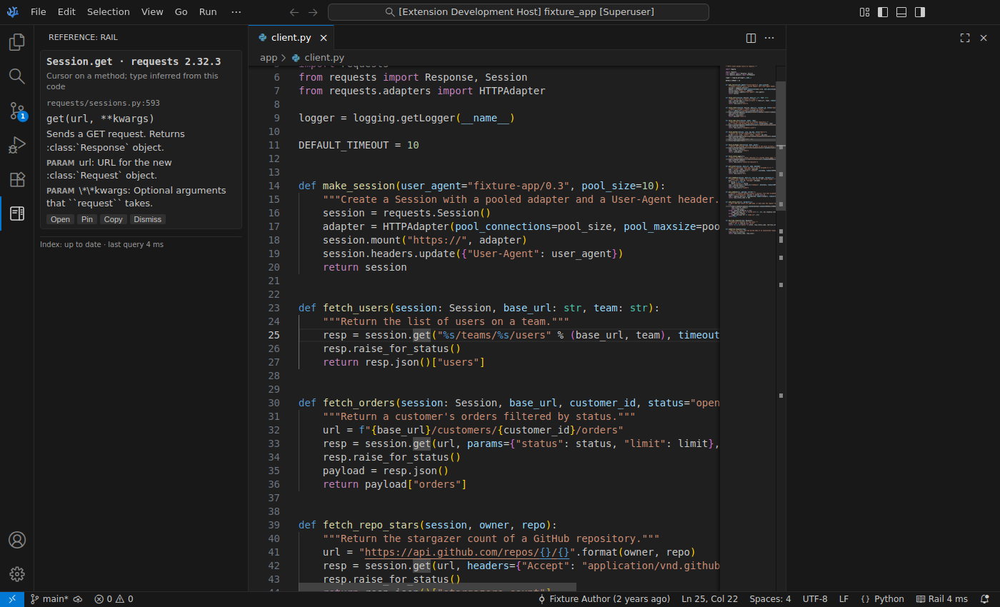
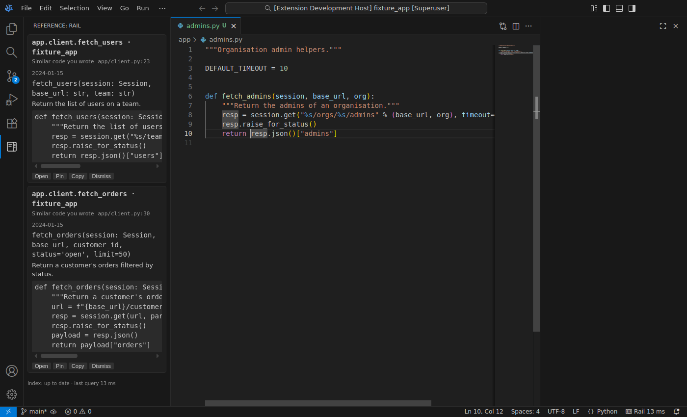

# Assistive · Reference Rail

Reference Rail is a VS Code companion for Python. It puts the documentation you were about to look up, and code you wrote before, in a side panel next to the cursor. You stay in the editor and still write every line yourself. The rail never edits your code.

- **API cards.** Put the cursor on a library, standard-library or builtin symbol (`requests.get`, `d.get` on a dict, `json.loads`). The card shows its signature, summary, return value, what it raises and up to 3 parameters. The title names the installed version (`requests.get · requests 2.32.3`).
- **Precedent cards.** Pause while writing a function and the rail shows the most similar function you already wrote. It searches this workspace, your other repos and functions you deleted from git history (marked "deleted in `<sha>`").
- **Frequent and Pinned.** Things you look up often collect under Frequent. Pin anything you want kept.
- **Every fact is verified.** Each fact links to a real file span, and text taken from a docstring must appear verbatim in the span it cites. A fact that fails the check is dropped. When nothing clears the confidence bar, the rail shows nothing.
- **Everything is local.** Indexing, embeddings and ranking run on your machine, and all data lives under `~/.reference-rail/`.

| API card (cursor on `session.get`) | Precedent cards (writing `fetch_admins`) |
|---|---|
|  |  |

The design is in [`reference-rail-design-plan.md`](reference-rail-design-plan.md). Progress against it is in [`PROGRESS.md`](PROGRESS.md), and every deviation is recorded in [`DECISIONS.md`](DECISIONS.md).

## Install

You need VS Code ≥ 1.90 (VSCodium and Cursor also work), Node ≥ 20, and Python ≥ 3.10 for the server. [`uv`](https://docs.astral.sh/uv/) is recommended. The project you edit can use any Python ≥ 3.8.

```bash
git clone https://github.com/ErrDivine/Assistive && cd Assistive/extension
npm ci
npm run install-local                 # or: node scripts/install-local.mjs --editor codium|cursor|insiders
```

`install-local` does three things:
1. Creates the server's own virtualenv in `server/.venv` with `uv sync`, or with `python -m venv` plus pip. This is separate from your project's environment.
2. Builds the extension.
3. Links it into the editor's extensions folder. Use `--copy` to copy instead.

Restart the editor and open a Python project. The first time, the server indexes your interpreter's packages and the standard library (well under a minute for a typical environment), then your workspace. Progress shows in the status bar.

**Optional:** for better precedent search, run **Reference Rail: Download Embedding Model** once. It fetches `sentence-transformers/all-MiniLM-L6-v2` (about 90 MB) into `~/.reference-rail/models`. This is the only time Reference Rail uses the network. Without the model, a built-in identifier-hashing embedder is used and everything stays offline.

To develop instead of install, open `extension/` in VS Code and press F5 after `cd server && uv sync`.

### Recommended layout

Drag the **Reference** view from the activity bar into the **secondary side bar** (View → Appearance → Secondary Side Bar). Cards then sit to the right of your code while the file explorer stays on the left.

## Commands

| Command | Default key | What it does |
|---|---|---|
| Reference Rail: Focus the Rail | `Ctrl+Alt+R` | Focus the rail. |
| Reference Rail: Ask About Symbol | `Ctrl+Alt+/` | Ask about the cursor position, with an optional question. Runs an API lookup plus a precedent search. |
| Reference Rail: Pin Top Card | | Pin the first live card. |
| Reference Rail: Pause / Resume | | Stop or restart automatic cards. |
| Reference Rail: Show Metrics | | Show the metrics report, with CSV export. |
| Reference Rail: Re-index | | Rebuild the index for the current interpreter and workspace. |
| Reference Rail: Ping | | Show the server version and process id. |
| Reference Rail: Download Embedding Model | | One-time download of the local embedding model. |
| Reference Rail: Clear All Data | | Delete `~/.reference-rail/`, including the index, events, pins and models. |
| Reference Rail: Show Server Log | | Open the server log. |
| Reference Rail: Set Up Server Environment | | Re-create the server's virtualenv. |

Each card has **Open**, **Pin**, **Copy** and **Dismiss** buttons:
- **Open** shows the source span beside your editor and leaves the cursor where it was. Runtime builtins and deleted functions open as read-only documents.
- **Copy** puts the signature or snippet on the clipboard. It never inserts anything.
- **Dismiss** hides a card for 10 minutes.

## Settings

| Setting | Default | Meaning |
|---|---|---|
| `referenceRail.enabled` | `true` | Show cards automatically. |
| `referenceRail.pythonPath` | `""` | The interpreter of the project to index. When empty, the Python extension's active interpreter is used, else `python3` on PATH. |
| `referenceRail.serverPath` | `""` | Python of the rail-server environment. When empty, the bundled `server/.venv` is used. |
| `referenceRail.extraRepos` | `[]` | Your other local repositories, searched for precedents. |
| `referenceRail.historyDepth` | `500` | How many recent commits to scan for deleted functions. `0` disables this. |
| `referenceRail.maxCards` | `3` | Most live cards shown at once. |
| `referenceRail.indexStdlib` | `true` | Index the interpreter's standard library. |
| `referenceRail.embeddingBackend` | `auto` | `auto` uses `hybrid` (identifier hashing plus the local model) when the model is downloaded, else `hashing`. |
| `referenceRail.embeddingModel` | `sentence-transformers/all-MiniLM-L6-v2` | The fastembed model. |
| `referenceRail.precedentThreshold` | *(calibrated)* | The cosine a precedent must reach. When empty, the value calibrated for the active embedder is used. |
| `referenceRail.recordSessions` | `false` | Record frames and results for replay (see Dogfooding below). |

## Privacy

- **No uploads.** All data (index, events, pins, models, recordings) stays in `~/.reference-rail/`, and there is no telemetry upload code. `Clear All Data` deletes the folder.
- **No network.** The server has no HTTP client, and its test suite runs with networking disabled. The one exception is the model download, which runs only when you invoke it.
- **Never indexed:** files matching `.env*`, `*secret*`, `*.pem`, `venv/`, `.venv/`, `node_modules/` or `site-packages/`, and anything your `.gitignore` excludes. Environment variables are never stored.
- **Probe is read-only.** The environment probe runs with your interpreter but only reads package metadata. It never imports your packages; it introspects builtins and standard C modules only.
- **Strict webview.** The rail webview has a strict CSP: no remote resources, and scripts load only with a nonce.

## Reading the metrics

**Reference Rail: Show Metrics** reports the last 14 days (the range can be changed):

- **External lookups per active editing hour** is the north-star metric; lower is better.
  - An *external lookup* is a window blur lasting 3 s to 10 min that started within 2 minutes of an edit, with no debug session running. It stands in for leaving the editor to look something up.
  - An *active hour* is an hour with at least 6 minutes that had edits.
  - The figure is also split by whether the rail was on or paused, which supports on/off-day comparisons.
- **Cards shown, opened, pinned and dismissed**, with the open rate per card kind (api, precedent, frequent). A high dismiss rate means the rail is interrupting more than it helps.
- **Query latency p50/p95** is the server-side `context/query` time. The budgets are 150 ms for API lookups and 400 ms with precedent search.
- **Empty-result rate per trigger.** Empty is fine: the rail prefers showing nothing over showing something wrong.

**Export CSV…** writes the same numbers as `metric,value` rows.

## Dogfooding guide

1. **Install and work as usual** for a few days, with the rail in the secondary side bar.
2. **Turn on `referenceRail.recordSessions`.** Each frame and its result are appended to `~/.reference-rail/sessions/<date>.jsonl`.
3. **When a card is wrong, dismiss it.** When one is missing, press `Ctrl+Alt+/`. Both are logged and show up in the metrics.
4. **Compare on and off days.** Pause the rail on alternate days with `Pause / Resume`, then compare "lookups per active hour (rail on / rail off)" in the metrics.
5. **Replay recordings against a new build** to compare latency and empty-result rates:
   ```bash
   uv run --project server python eval/run_eval.py --replay ~/.reference-rail/sessions/2026-10-01.jsonl
   ```
6. **Turn missed cases into eval queries.** Add them to `eval/queries.jsonl` (schema below) and re-run the evaluation.

## Repository layout and development

```
extension/   VS Code extension (TypeScript, no UI framework)
server/      rail-server (Python, own uv-managed virtualenv); JSON-RPC over stdio
eval/        fixtures (make_fixtures.py), 108 labeled queries, run_eval.py, baseline.json
scripts/     check_invariants.sh (I1 no buffer edits, I4 no network, I7 no telemetry)
```

```bash
# server
cd server && uv sync
uv run ruff check rail_server tests && uv run mypy rail_server
uv run python ../eval/fixtures/make_fixtures.py         # fixture venv + git repos
RAIL_NO_NETWORK=1 uv run pytest -q                       # 62 tests, network disabled

# extension
cd extension && npm ci
npm run lint && npm run typecheck && npm run test:unit   # 274 unit tests
xvfb-run -a npm run test:integration                     # 15 tests in a real VS Code
#   VSCODE_EXECUTABLE=/path/to/codium uses an existing VS Code/VSCodium build

# evaluation (recall@3, MRR, precision, latency, empty rate; fails on >5% regression)
uv run --project server python eval/run_eval.py --check eval/baseline.json
uv run --project server python eval/run_eval.py --calibrate      # choose the precedent threshold
uv run --project server python eval/run_eval.py --spike          # compare embedding models
```

Each line of `eval/queries.jsonl` has these fields:
- `kind`: `api`, `precedent` or `diagnostic`.
- `trigger`.
- `file`.
- `at`: `{find, offset, occurrence}`, which places the cursor.
- `definition`: an optional simulated go-to-definition.
- `hover`.
- `enclosing_text` (precedent queries only).
- `diagnostics`.
- `expected`: a list of qualnames. `[]` means nothing should be shown.
