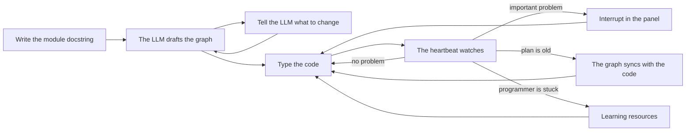

# 1. Introduction

This document tells what Assistive is, who it is for, and how it works at a high level. It also gives the main concepts and the limits.

## 1.1 Purpose

Assistive helps a programmer who does not have much experience yet. It does not write the code for the programmer. It does three things:

1. It makes a plan of the file before the programmer types the code. The plan is an **implementation graph**.
2. It keeps the plan and the code the same while the programmer types.
3. It watches the code and tells the programmer about important problems. It also recommends good resources to learn from.

The programmer types every line of code. Assistive never changes the files of the programmer. This rule is invariant I1 (refer to [Architecture](06-architecture.md#63-invariants)).

## 1.2 The workflow

The workflow has five steps:

1. **Write the module docstring.** At the top of a new file, describe what the file must do. In Python, this is a `"""docstring"""`. In TypeScript or JavaScript, this is a `/** comment */` or a group of `//` lines.
2. **Examine the draft.** When the docstring is complete, the LLM drafts a graph. Each node is a piece of code to type: a function, a class, a method, a data type, a constant or a test. Each node has a signature, a description, technical notes and a position in the typing order.
3. **Steer the plan.** Type instructions in the input box of the panel, for example "split the parse into its own function". The LLM changes the graph with its tools and writes a short summary.
4. **Type the code.** The graph follows the code. A node changes from *planned* to *stubbed* to *done* as the code appears.
5. **Let the heartbeat watch.** At a calm interval, Jev examines the latest change. If Jev finds a possible problem, the LLM examines it. The LLM then interrupts the programmer or stays quiet.

## 1.3 Main concepts

| Concept | Description |
|---|---|
| Implementation graph | The plan for one source file. It has nodes and edges. Each source file has its own graph. |
| Node | One piece of the plan: a function, a class, a method, a data type, a constant, a test, an external dependency or a step. |
| Edge | A relation between two nodes: `calls`, `uses`, `contains`, `creates`, `reads`, `writes`, `returns` or `depends`. |
| Status | The state of a node: `planned` (no code yet), `stubbed` (the body is a placeholder), `done` (the body has real code) or `attention` (the heartbeat found a problem). The code sets the status, not the LLM. |
| Module docstring | The text at the top of the file that tells what the file does. The draft starts from this text. The code calls it the "module string". |
| LLM | A large language model with an OpenAI-compatible Chat Completions API and tool calls. It drafts and changes the graph, answers questions and writes interrupts. |
| Tool | A function that the LLM can call. There are 18 tools. They read the project, edit the graph, or show something to the programmer. Refer to the [Tool reference](10-tool-reference.md). |
| Jev | The System One model of TypeSafe AI. It answers typed questions with calibrated probabilities in less than one second. Assistive uses it as a fast, low-cost first check. |
| Heartbeat | A periodic check of the latest change. One check is a **beat**. |
| Triage | The first part of a beat. Jev (or the LLM in fallback mode) answers five questions about the latest change. |
| Escalation | The second part of a beat. If the triage answers pass the thresholds, the LLM examines the change and decides if it interrupts. |
| Interrupt | A short message about one concrete problem. It shows in the panel, as a squiggle on the line, and on the graph node. |
| Feed | The list of messages in the panel: your messages, the LLM replies, interrupts, resources, questions and system notes. |

## 1.4 System One and System Two

Assistive uses two models in the same way that a person uses fast and slow thought.

- **Jev is the System One.** It is fast and has a low cost. Each beat sends one request to Jev with five questions. Jev answers in about 70 to 500 ms.
- **The LLM is the System Two.** It is slow and has a high cost. It reads the code, thinks, and uses tools. Assistive asks the LLM only when the answers from Jev justify it.

This design keeps the cost low and the interrupts rare. The thresholds are in [Jev and the heartbeat](11-jev-and-heartbeat.md#114-verdicts-and-decision-rules-policyts).

## 1.5 Supported editors and languages

- **Editors:** VS Code 1.101 or newer, VSCodium, Cursor and VS Code Insiders.
- **Languages:** Python, TypeScript and JavaScript, with TSX and JSX.
- **LLM providers:** any provider with an OpenAI-compatible Chat Completions API and tool calls. Examples are OpenAI, Azure OpenAI, OpenRouter, vLLM, Ollama and LM Studio.
- **Jev:** a Jev API key from TypeSafe AI. This key is optional. Without it, the LLM can do the triage (`ASSISTIVE_TRIAGE=llm`).

## 1.6 Data that leaves the computer

Assistive sends data to three types of destination:

| Destination | Data |
|---|---|
| The LLM endpoint | The module docstring, outlines, code that the LLM asks for, diffs, diagnostics and your messages. |
| Jev | A compact state of the latest change. It has a maximum of about 60 lines of the current scope and 3000 characters of diff. |
| Recommended web sites | One `HEAD` request (or a one-byte `GET` request) to each recommended link, to make sure that the link works. |

The tools never read files that look like secrets: `.env` files, keys, credentials and similar files. Refer to [Code analysis](07-code-analysis.md#75-workspace-access-and-project-context-contextts).

## 1.7 Limits

- Assistive makes outlines and graphs only for Python, TypeScript and JavaScript.
- The quality of drafts and interrupts depends on the LLM. Use a model that is good at tool calls.
- The Jev request format follows the public documentation of TypeSafe AI. The tests use a fake Jev server. Run **Assistive: Test LLM and Jev Connections** after you write your key.
- The graph of a file holds a maximum of 60 nodes and 150 edges.
