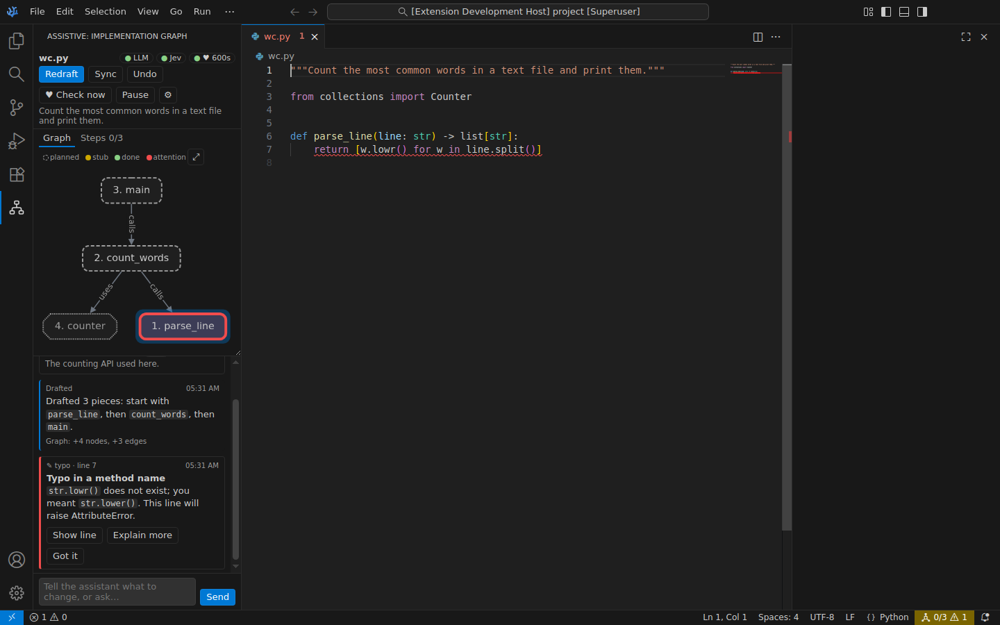
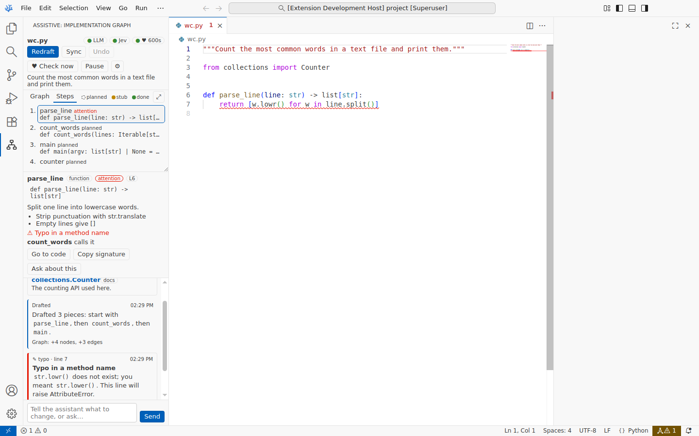

# 4. User guide

This document tells how to use Assistive. Section 4.1 describes the panel. The other sections give step-by-step procedures.

Before you start, install and configure Assistive. Refer to [Installation](02-installation.md) and [Configuration](03-configuration.md).

## 4.1 The panel

To open the panel, push `Ctrl+Alt+G` or click the Assistive icon in the activity bar. The panel has four areas, from the top to the bottom.

| Heartbeat interrupt | Steps and node details |
|---|---|
|  |  |

### 4.1.1 Header

| Item | Function |
|---|---|
| File name | The workspace-relative path of the file that the panel shows. Click it to open a different file that has a graph. |
| **LLM** pill | Green: the LLM is configured. Yellow: the LLM is not configured. Red: the last LLM request failed. Click a yellow or red pill to open the `.env` file. |
| **Jev** pill | Green: Jev is configured. Yellow: the Jev key is not there. Red: the last Jev request failed. Grey: the triage is `llm` or `off`. |
| **♥ 45s** pill | The heartbeat is on, with its interval. The tooltip shows the time and the verdict of the last beat. "♥ paused" means that the heartbeat is off. |
| **Draft** / **Redraft** | Draft the graph from the module docstring. The label is **Redraft** when the file has a graph. |
| **Sync** | Ask the LLM to make the graph agree with the code. |
| **Undo** | Restore the graph before the last change. |
| **♥ Check now** | Run one beat now. |
| **Pause** / **Resume** | Turn the heartbeat off or on. |
| **⚙** | Open the `.env` file. |
| Docstring line | The module docstring. Click it to show all of the text. A "…" at the end means that the docstring is not complete. If the docstring changed after the draft, the line shows **redraft?**. |

### 4.1.2 Graph area

The graph area has two tabs:

- **Graph** shows the nodes and edges in a top-to-bottom layout. The number before a label is the position of the node in the typing order.
- **Steps** shows the nodes in typing order, with the status and the signature of each node. The tab label shows your progress, for example **Steps 3/7**. The next piece to type has a **next** badge.

The count includes only the pieces that you type: classes, functions, methods, data types, constants and tests. It does not include `external` and `step` nodes. The next piece is the first piece in typing order that is not done. In the graph, the next node has a colored halo.

The legend shows the colors of the statuses. The **⤢** button fits the graph into the area again. Drag the bottom edge of the area to change its height.

**Statuses:**

| Status | Look | Description |
|---|---|---|
| planned | Dashed border | The symbol is not in the code. |
| stubbed | Yellow | The symbol exists, but its body is a placeholder: `pass`, `...`, `raise NotImplementedError`, an empty `{}`, or `throw new Error("not implemented")`. |
| done | Green, thick border | The symbol has a real body. |
| attention | Red, thicker border | An interrupt flagged a problem in this node. |

**Node shapes:**

| Shape | Node kind |
|---|---|
| Rounded rectangle | `function`, `method`, `class` (bold), `module` (bold) |
| Cut rectangle, dotted, grey text | `external` |
| Barrel | `data` |
| Ellipse | `step` |
| Hexagon | `test` |
| Tag | `constant` |

**Edges:** A `contains` edge is dashed and has no arrow. A `depends` edge is dotted. All other edges are solid lines with an arrow.

**Mouse actions:**

- Click a node to select it. The panel dims the nodes that are not its neighbors, and shows its details.
- Click the empty background to clear the selection.
- In the **Steps** tab, use the keyboard: the up and down arrows move between steps, `Enter` selects a step, and `Ctrl+Enter` (`Cmd+Enter` on macOS) goes to its code.
- Double-click a node to go to its code, if the code exists.
- Use the mouse wheel to zoom. Drag the background to move the graph.

### 4.1.3 Node details

When you select a node, the details box shows the buttons under the title, and then:

- the label, the kind, the status and the line number;
- the signature;
- the description;
- the technical notes;
- the reason for the flag, if the status is `attention`;
- the edges to and from the node.

The box has four buttons:

| Button | Function |
|---|---|
| **Go to code** | Open the code of the node. The button shows "Not typed yet" if the code does not exist. |
| **Hint** (if the code is not done) | Ask the LLM for the steps and the APIs to implement the node, without the code. |
| **Review** (if the code is done or flagged) | Ask the LLM for a review of your code for the node: correctness, the edge cases of the plan, and a clearly better way. The LLM points to lines and does not rewrite the code. |
| **Copy signature** | Copy the signature to the clipboard. Assistive does not paste it into your file. |
| **Ask about this** | Put "About \`symbol\`: " into the input box. |

### 4.1.4 Feed and input box

The feed shows the conversation and the events for the current file. The newest item is at the bottom.

| Item | Look |
|---|---|
| Your message | Aligned on the right side |
| Assistant reply | Markdown text with a label: "Drafted", "Synced", "Heartbeat" or "Assistant". A line such as "Graph: +4 nodes, +3 edges" shows the graph changes. While the LLM writes a reply, the text shows at the bottom of the feed with a cursor that blinks. Put the mouse pointer on the time of a reply to see the tokens that it used. |
| Interrupt | A card with the issue kind, the line number, a title, a message and three buttons. The color shows the severity. |
| Resources | "📚 Learn: topic" with a list of links. Each link has a type and one sentence about its use. |
| Question | A question from the LLM, with buttons for the answers. |
| Code reference | A link to lines in a file, with a note. |
| System note | An information, warning or error message from Assistive. |

The input box is at the bottom. Push `Enter` to send. Push `Shift+Enter` to start a new line. A line with a spinner above the input box shows the current task, for example "Drafting the graph…". The **Stop** button on that line stops the task.

### 4.1.5 Status bar item

The status bar shows an Assistive item on the right side.

| Text | Description |
|---|---|
| Graph icon and two numbers, for example `3/7` | Assistive is ready. The numbers show how many pieces of the plan you typed, of the total. The tooltip names the next piece. |
| Spinner and a task | The LLM works, for example "Drafting the graph". |
| Graph icon, warning icon and a number | The number of open interrupts. The background is the warning color. |

Click the item to open the panel.

## 4.2 Draft a graph automatically

Assistive drafts a graph automatically when all of these conditions are true:

- The setting `assistive.autoDraft` is `true`.
- The LLM is configured.
- The file has no graph.
- You typed in the module docstring, or in the line below it.
- The module docstring is complete (closed) and has 15 characters or more.
- Approximately 2.5 seconds passed after your last change.
- Assistive did not try a draft for the same docstring text before.

> **Note:** Assistive does not draft a file that you only open. Use the **Draft** button for a file that has a docstring already.

1. Create or open a Python, TypeScript, JavaScript, Go, Rust or Java file.
2. At the top of the file, type a module docstring. Describe what the file must do. Give enough detail, for example the inputs, the outputs and the important rules.

   Python:

   ```python
   """Fetch open issues for a GitHub repository
   and cache them on disk with ETags."""
   ```

   TypeScript or JavaScript:

   ```ts
   /**
    * Rate-limit outgoing HTTP requests with a
    * token bucket shared across callers.
    */
   ```

   Go (the package comment):

   ```go
   // Package cache stores HTTP responses on disk
   // and revalidates them with ETags.
   package cache
   ```

   Rust (inner doc comments):

   ```rust
   //! Parse a CSV file of transactions and
   //! report the balance of each account.
   ```

   Java (a comment above the `package` line):

   ```java
   /**
    * Schedules meetings for a team: finds free
    * slots across calendars and books them.
    */
   package com.example.scheduler;
   ```

3. Close the docstring. Type `"""` or `*/` at its end. For a group of `//` lines, start the code (for example the `package` line) below it.
4. Wait. The panel shows "Drafting the graph…".
5. Read the summary in the feed. It tells you which node to start with.
6. Examine the graph and the **Steps** tab.

For a group of `//` lines, the comment is complete when a line of code, or an empty line and more text, follows it.

## 4.3 Draft or redraft a graph manually

1. Make sure that the file has a module docstring.
2. Click **Draft** (or **Redraft**) in the panel. You can also run **Assistive: Draft Graph from Module Docstring**.
3. Wait for the summary in the feed.

For a redraft, the LLM keeps the IDs of the nodes that still fit. It changes or removes the other nodes and adds the nodes that are necessary. The previous graph goes on the undo stack.

## 4.4 Change the plan with an instruction

1. Click the input box, or push `Ctrl+Alt+/` in the editor.
2. Type an instruction. Examples:
   - "Split the parse into its own function."
   - "Add a cache with a time limit of 5 minutes."
   - "Remove the CLI part. This module is a library."
3. Push `Enter`.
4. Watch the graph. The changes show while the LLM works.
5. Read the reply in the feed.

> **Note:** If the LLM works on a different request for the same file, your message waits. It shows in the feed at once and runs when the first request is done. A heartbeat check in progress stops for your message. To stop the current request, refer to [4.17](#417-stop-a-request).

## 4.5 Ask a question

1. Type the question in the input box, for example "What is the best way to cache this?".
2. Push `Enter`.
3. Read the answer. If the answer points to lines in your code, click the code reference to go there.

If the question is only a question, the LLM does not change the graph.

To ask about one node, select the node and click **Ask about this**.

## 4.6 Answer a question from the LLM

Sometimes the LLM must know a design decision that only you can make. It then shows a question with two to four answers. It also makes a default choice in the graph and writes it in the notes of the node.

1. Read the question in the feed.
2. Do one of these:
   - Click one of the answer buttons.
   - Click **Answer…** and type your own answer.
3. Read the reply. The LLM changes the graph if your answer is different from its default.

## 4.7 Type the code

1. Open the **Steps** tab to see the typing order.
2. Select the first node to read its signature and notes.
3. Type the code yourself. Optional: click **Copy signature** and paste the signature.
4. Stop typing for a moment.
5. Look at the status of the node. It changes to **stubbed** or **done**. The **next** badge moves to the next piece.

The statuses change approximately one second after you stop typing. You do not have to save the file. A Python `def` with only `pass` is stubbed. When you add a real body, the node changes to done.

## 4.8 Sync the graph with the code

Use this procedure if you renamed functions, added functions that the plan does not have, or abandoned parts of the plan.

1. Click **Sync**, or run **Assistive: Sync Graph with Code**.
2. Read the reply. The reply is "Graph already matches the code." if the LLM changed nothing.

The heartbeat also starts a sync automatically if it finds that the graph is out of date. It does this a maximum of one time in 3 minutes.

## 4.9 Undo a graph change

1. Click **Undo**, or run **Assistive: Undo Last Graph Change**.

Assistive keeps the last 20 revisions of each graph. Each graph change by the LLM adds one revision. A clear also adds one revision. Status changes from the code and interrupt flags do not add a revision. **Undo** after the first draft of a file gives an empty graph. Click **Draft** to draft again.

## 4.10 Use the heartbeat

The heartbeat runs a beat when all of these conditions are true:

- You typed in the file after the last beat.
- The interval passed (45 seconds by default).
- You stopped typing for 2 seconds.
- The editor window has the focus.

A beat is quiet when there is no important problem. You see nothing in the feed.

### 4.10.1 Run a beat now

1. Click **♥ Check now**, or run **Assistive: Run a Heartbeat Now**.

### 4.10.2 Pause or resume the heartbeat

1. Click **Pause** (or **Resume**), or run **Assistive: Pause / Resume Heartbeat**.

This changes the user setting `assistive.heartbeat.enabled`.

### 4.10.3 Examine the last verdict

1. Put the mouse pointer on the **♥** pill.
2. Read the tooltip. It shows the time of the last beat and the verdict, for example `jev: interrupt 0.08 · no issue · severity 0.1 · graph 0.12 · stuck 0.05`.

## 4.11 Handle an interrupt

An interrupt shows in four places:

- a card in the feed;
- a squiggle on the line in the editor (blue for severity 1, yellow for 2, red for 3);
- a red node in the graph (the node that contains the line);
- a notification, if the panel is hidden and `assistive.notifications` is `toast`.

1. Read the title and the message on the card.
2. Do one of these:
   - Click **Show line** to go to the line.
   - Click **Explain more** to ask the LLM for a longer explanation and resources.
   - Click **Got it** to dismiss the interrupt.
3. Change the line to correct the problem.

When you change the text of the flagged line, the interrupt changes to *resolved* automatically. The squiggle and the red node go away. If you only add lines above the flagged line, the interrupt moves with its line.

> **Note:** Assistive does not show the same interrupt two times. An interrupt with the same issue kind and the same line text stays hidden until the first one is resolved.

> **Note:** Sometimes you click **Got it** on two interrupts of the same kind, for example two "better implementation" notes. Then the heartbeat stops interrupts of that kind for the rest of the session. Only an urgent problem (severity 2.5 or more) of that kind still comes through.

## 4.12 Use the recommended resources

1. Read the topic and the sentence under each link.
2. Click a link. It opens in your web browser.

Assistive examines each link before it shows the link. It removes links that give HTTP 404 or 410. A link with "(link not checked)" did not answer the check, but it can still work.

## 4.13 Export the graph

1. Run **Assistive: Export Graph as Mermaid**.
2. Read the new untitled Markdown document. It contains the docstring and a Mermaid `flowchart TD`.
3. Save the document where you want it, or close it.

## 4.14 Clear the graph

1. Run **Assistive: Clear Graph for This File**.
2. Click **Clear** in the dialog.

> **Note:** **Undo** restores a cleared graph.

## 4.15 Commands

| Command | Function |
|---|---|
| Assistive: Focus the Graph Panel | Open the panel (`Ctrl+Alt+G`). |
| Assistive: Tell the Assistant… | Open the panel and put the focus in the input box (`Ctrl+Alt+/`). |
| Assistive: Draft Graph from Module Docstring | Draft or redraft the graph. |
| Assistive: Sync Graph with Code | Make the graph agree with the code. |
| Assistive: Undo Last Graph Change | Restore the previous revision. |
| Assistive: Clear Graph for This File | Remove the graph. |
| Assistive: Stop the Current Request | Stop the LLM request in progress. |
| Assistive: Clear Conversation for This File | Remove the messages of the file from the feed. The graph and the open interrupts stay. |
| Assistive: Open a Planned File… | Select a file that has a graph, with its progress, and open it. |
| Assistive: Run a Heartbeat Now | Run one beat. |
| Assistive: Pause / Resume Heartbeat | Turn the heartbeat off or on. |
| Assistive: Export Graph as Mermaid | Open the graph as Mermaid text. |
| Assistive: Open API Configuration (.env) | Open the `.env` file. Create it from the template if necessary. |
| Assistive: Test LLM and Jev Connections | Send one test request to each service. |

## 4.16 What the panel shows for other files

- If you open a file in a language that Assistive does not support, the panel continues to show the last supported file. Thus you can read documentation or a configuration file and keep the plan in view.
- If no supported file was open before, the panel tells you to open a supported file.

## 4.17 Stop a request

Use this procedure if the LLM works on a request that you do not want, or if it takes too long.

1. Click **Stop** on the line with the spinner, above the input box. You can also run **Assistive: Stop the Current Request**.
2. Read the note "Stopped. The graph is as it was before." in the feed.

Assistive removes the graph changes that the stopped request made. If a different request waits, that request starts now.

## 4.18 See the plan in the editor

1. Put the mouse pointer on the name of a function, class or method in the editor.
2. Read the hover. It shows "Assistive plan", the status, the step number, the planned signature, the description and the notes of the node.

The hover works at the definition and at each call. It also works for a name that you did not define yet, if the plan has it. If two nodes have the same short name (for example `Cache.get` and `Store.get`), the hover shows a node only at its own definition.

## 4.19 Ask for a hint or a review

1. Select the node in the graph or in the **Steps** tab.
2. Do one of these:
   - If you do not know how to start, click **Hint**.
   - If you finished the code of the node, click **Review**.
3. Read the reply in the feed.

The buttons send a normal message, so the reply also shows in the feed and the LLM can change the graph or recommend resources.

## 4.20 Clear the conversation

Use this procedure if the feed of a file is long, or if you want the LLM to forget the earlier messages.

1. Run **Assistive: Clear Conversation for This File**.
2. Click **Clear** in the dialog.

The graph and the open interrupts stay. The LLM no longer receives the earlier messages.

## 4.21 Open a different planned file

Use this procedure in a project with more than one planned file.

1. Click the file name in the header of the panel, or run **Assistive: Open a Planned File…**.
2. Read the list. Each item shows the path, your progress (for example `3/7 done`), the next piece and the first line of the docstring. The most recent graph is first.
3. Select a file. It opens in the editor, and the panel shows its graph.

A draft can also use a different planned file. If the file imports it, the LLM receives the symbols that it plans and that you did not type yet.

## 4.22 When all pieces are typed

When each planned piece is **done**, a green line shows under the tabs: "✓ All N planned pieces are typed." It has two buttons:

| Button | Function |
|---|---|
| **Review the file** | Ask the LLM to review the whole file against the plan: correctness, the edge cases in the notes, error handling and clearly better ways. The LLM points to lines and does not rewrite the code. |
| **Plan tests** | Ask the LLM to add `test` nodes to the graph, with the cases that each test checks. The LLM also tells you where the tests go in the project. |

The line goes away while the LLM works, and when a new piece is added to the plan.

