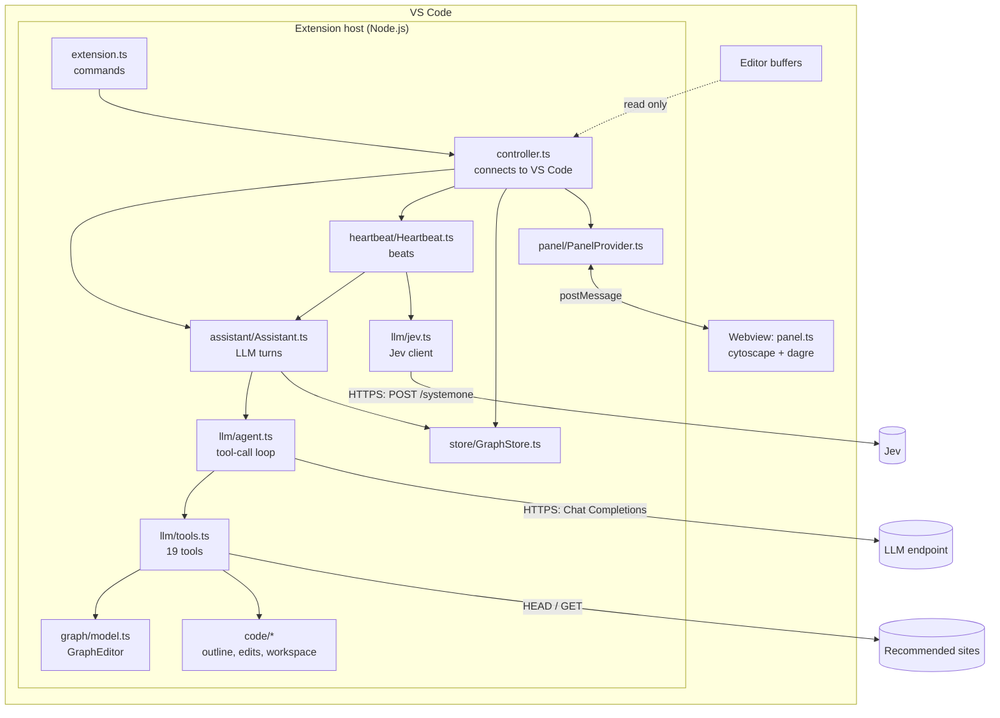
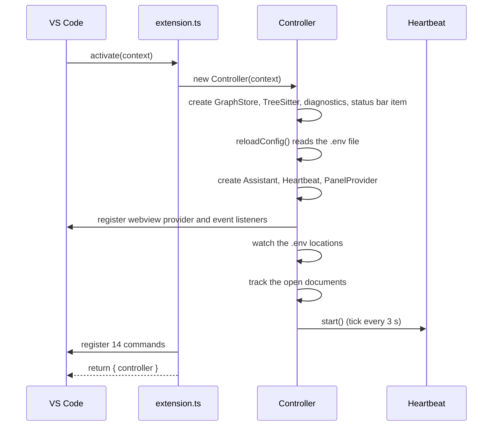
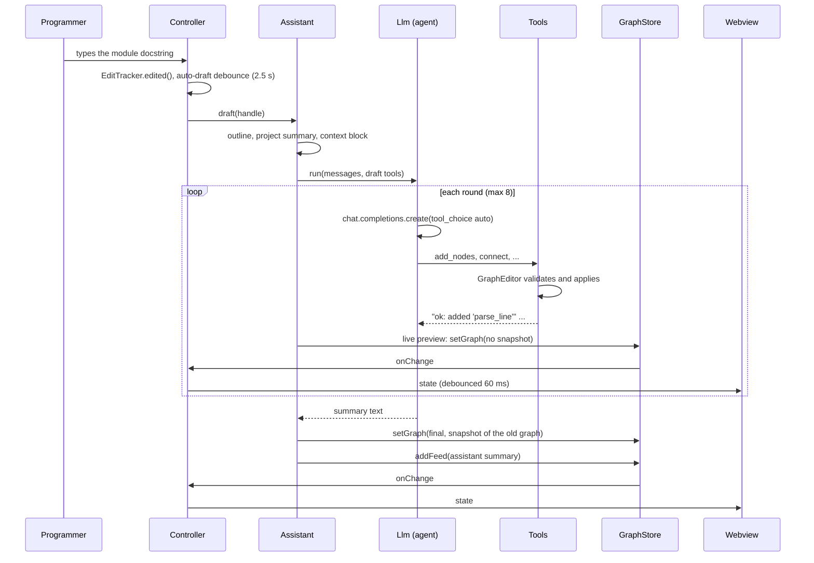
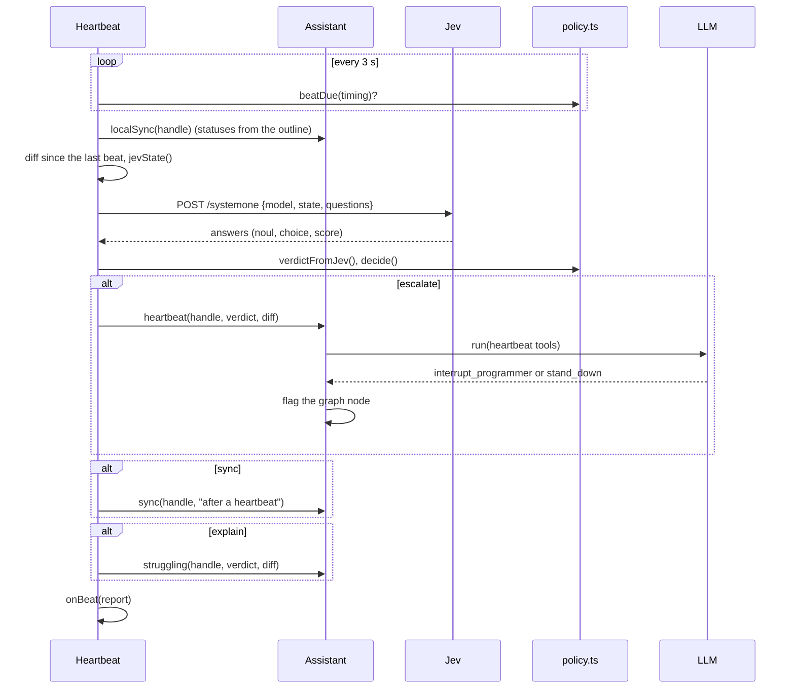
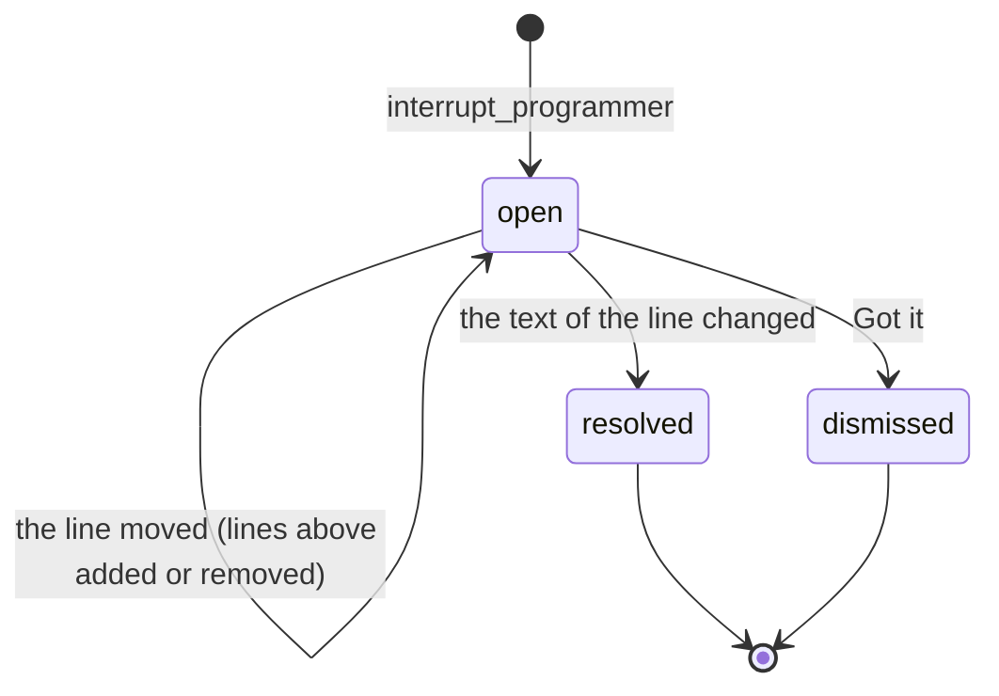

# 6. Architecture

This document gives the structure of the Assistive code. It tells which components exist, how data moves between them, which rules they obey, and which data types they share. The documents 07 to 16 then describe each component in detail.

## 6.1 Overview

Assistive is a VS Code extension in TypeScript. All of its logic runs in the VS Code **extension host** process. There is no second process to install or start (decision D1 in `DESIGN.md`). The panel is a **webview**: a small web page in a separate browser context. The extension talks to two external services with HTTP: the LLM and Jev.

## 6.2 Components

The source code is in `extension/src/`. Most modules do not import `vscode`. Thus the unit tests can run them in plain Node.js with fakes. Only four modules use the VS Code API.

| Module | Role | Imports `vscode` | Document |
|---|---|---|---|
| `extension.ts` | Activation entry point. Registers the commands. | Yes | [15](15-controller.md) |
| `controller.ts` | Connects all parts to VS Code: events, configuration, squiggles, status bar, panel messages. | Yes | [15](15-controller.md) |
| `panel/PanelProvider.ts` | Hosts the webview and sends messages to it. | Yes | [14](14-panel.md) |
| `code/workspace.ts` | `VsWorkspace`: reads files, searches and lists diagnostics through the VS Code API. | Yes | [7](07-code-analysis.md) |
| `panel/webview/panel.ts` | The panel user interface. Runs in the webview, not in the host. | No (browser) | [14](14-panel.md) |
| `config/env.ts` | Reads and validates the `.env` file. | No | [3](03-configuration.md#part-b-how-the-code-reads-the-configuration) |
| `code/treesitter.ts` | Loads the tree-sitter WASM runtime and grammars. | No | [7](07-code-analysis.md) |
| `code/outline.ts` | Finds the module docstring, the symbols and the imports of a file. | No | [7](07-code-analysis.md) |
| `code/langs.ts` | The symbol and import extractors for Go, Rust and Java. | No | [7](07-code-analysis.md) |
| `code/tsutil.ts` | Shared helpers over tree-sitter nodes: signatures, doc comments, `cleandoc`. | No | [7](07-code-analysis.md) |
| `code/pyscope.ts` | Python helpers for the fallback outline. | No | [7](07-code-analysis.md) |
| `code/changes.ts` | Diffs and the `EditTracker`. | No | [7](07-code-analysis.md) |
| `code/context.ts` | The `WorkspaceAccess` interface, path rules and the project summary. | No | [7](07-code-analysis.md) |
| `code/debounce.ts` | A debouncer with replaceable timers. | No | [7](07-code-analysis.md) |
| `graph/model.ts` | The `GraphEditor`, status sync, flags and text renderings. | No | [8](08-graph-model.md) |
| `graph/order.ts` | The typing order of nodes. | No | [8](08-graph-model.md) |
| `llm/schema.ts` | A small JSON Schema validator. | No | [9](09-llm-agent.md) |
| `llm/agent.ts` | The OpenAI tool-call loop. | No | [9](09-llm-agent.md) |
| `llm/prompts.ts` | The system prompt and the instructions for each mode. | No | [9](09-llm-agent.md) |
| `llm/tools.ts` | The 19 tools and the tool set of each mode. | No | [10](10-tool-reference.md) |
| `llm/jev.ts` | The Jev client. | No | [11](11-jev-and-heartbeat.md) |
| `heartbeat/policy.ts` | The Jev questions, the verdicts and the decision rules. | No | [11](11-jev-and-heartbeat.md) |
| `heartbeat/Heartbeat.ts` | The heartbeat runner. | No | [11](11-jev-and-heartbeat.md) |
| `assistant/Assistant.ts` | The LLM turns: draft, chat, sync, heartbeat, struggle. | No | [12](12-assistant.md) |
| `store/GraphStore.ts` | The graph, feed and undo history of each file. | No | [13](13-store-and-resources.md) |
| `resources/links.ts` | The link check. | No | [13](13-store-and-resources.md) |
| `types.ts` | The shared data types. | No | [6.7](#67-shared-types) |

### 6.2.1 Dependency direction

The dependencies go in one direction:

1. `extension.ts` uses `controller.ts`.
2. `controller.ts` uses all other host modules.
3. `Heartbeat` uses `Assistant`. `Assistant` uses the agent, the tools, the graph model and the store.
4. The tools use the graph model, the code analysis and the link check.
5. The pure modules (`code/`, `graph/`, `llm/schema.ts`, `heartbeat/policy.ts`, `types.ts`) use nothing above them.

The webview script imports only `types.ts` and `graph/order.ts`. Both modules import only types, so the webview bundle stays small.

## 6.3 Invariants

The design has five invariants. Each invariant has a mechanism that enforces it.

| ID | Rule | Enforcement |
|---|---|---|
| I1 | Assistive never modifies the buffers of the programmer. **Copy signature** uses the clipboard. **Export** opens a new untitled document. | An ESLint rule forbids `applyEdit`, `edit`, `insertSnippet` and `new WorkspaceEdit` in `src/`. The integration test "never modified the programmer's buffer (I1)" records each change that the test did not type. |
| I2 | The LLM changes the graph only through validated tools. | The schema validator examines the arguments before a tool runs. The `GraphEditor` returns `ok …` or `error …` for each item. |
| I3 | Interrupts are rare and earned. | Jev thresholds, a cooldown, a maximum of one interrupt per beat, no repeat for an unchanged line, and the `stand_down` tool. |
| I4 | Secrets are never sent. | The tools refuse `.env` files, keys and credential files (`isSecretPath`). The `.env` file has mode 600 and is in `.gitignore`. |
| I5 | Typing is never blocked. | All network work is asynchronous. A beat starts only after a 2-second pause and never runs two times at the same time. Updates to the webview are debounced. |

## 6.4 Data flows

### 6.4.1 Activation

VS Code activates the extension when it opens a Python, TypeScript, JavaScript, Go, Rust or Java file, or when the startup is complete (`onStartupFinished`).

### 6.4.2 Draft

### 6.4.3 Chat

A chat turn is almost the same as a draft. The differences are:

- The panel sends `{type: "send", text}`. The controller calls `Assistant.chat`.
- The Assistant adds the message to the feed first.
- The context has the cursor position, the outline, the graph, the diagnostics and the message.
- The messages include the last 8 user and chat replies from the feed.
- The tool set also has `point_to_code`, `get_project_context` and `get_recent_edits`.

### 6.4.4 Heartbeat

### 6.4.5 Status sync from the code

The LLM does not set the status of a symbol node. The code sets it:

1. The controller or the heartbeat calls `Assistant.localSync`. This occurs at three times:
   - 800 ms after the last change to the active file;
   - when the programmer saves a file;
   - at each beat.
2. `localSync` computes the outline of the live text.
3. `syncWithOutline` finds the symbol of each node and sets `planned`, `stubbed` or `done`. It keeps `attention`.
4. If a status or a line changed, the store saves the graph without an undo snapshot.

An LLM turn also calls `syncWithOutline` on each graph that it publishes. Thus a new node shows the correct status immediately.

### 6.4.6 Interrupt life cycle

When an interrupt opens, the controller adds a squiggle, flags the graph node and updates the status bar. When an interrupt closes, the controller removes the squiggle and clears the flag.

## 6.5 Concurrency and timing

The extension host has one JavaScript thread. Assistive uses `async` functions and timers so that it never blocks the editor.

| Mechanism | Value | Location |
|---|---|---|
| One LLM turn per file at a time | A queue for each file (`Assistant.exclusive`) | `assistant/Assistant.ts` |
| Programmer requests wait for each other | The queue | `assistant/Assistant.ts` |
| A programmer request cancels a heartbeat turn | `AbortController` with the reason `preempted` | `assistant/Assistant.ts` |
| A heartbeat turn never cancels or delays a request | `silent` turns start only when the file is free | `assistant/Assistant.ts` |
| One beat at a time | `Heartbeat.beating` flag | `heartbeat/Heartbeat.ts` |
| Heartbeat tick | 3 s | `heartbeat/Heartbeat.ts` |
| Pause before a beat | 2 s | `heartbeat/policy.ts` |
| Panel refresh debounce | 60 ms | `controller.ts` |
| Status sync after typing (live sync) | 800 ms | `controller.ts` |
| Auto-draft debounce | 2.5 s | `controller.ts` |
| Interrupt reconcile debounce | 400 ms | `controller.ts` |
| Store save debounce | 400 ms | `store/GraphStore.ts` |
| Link check timeout | 4 s for each link | `resources/links.ts` |

## 6.6 Persistence

The `GraphStore` keeps one record for each file. A record has the graph, the feed (maximum 200 items) and the undo history (maximum 20 revisions). The store writes each record as JSON to `<workspace storage>/graphs/<sha1 of the path, 16 hex characters>.json`. Assistive never writes into the repository. Refer to [Store and resources](13-store-and-resources.md).

## 6.7 Shared types

The file `src/types.ts` defines the types that the host and the webview share. It has no `vscode` import.

### 6.7.1 Graph types

| Type | Definition |
|---|---|
| `NODE_KINDS` | `module`, `class`, `function`, `method`, `data`, `constant`, `test`, `external`, `step` |
| `EDGE_KINDS` | `calls`, `uses`, `contains`, `creates`, `reads`, `writes`, `returns`, `depends` |
| `NodeStatus` | `planned`, `stubbed`, `done`, `attention` |

**`GraphNode`**

| Field | Type | Description |
|---|---|---|
| `id` | string | A stable snake_case slug, unique in the graph, for example `fetch_issues`. |
| `kind` | `NodeKind` | What the node is. |
| `label` | string | A short display name. The default is the symbol or the ID. |
| `symbol` | string, optional | The code name that the programmer types, for example `Cache.get`. |
| `signature` | string, optional | The planned signature in the language of the file. |
| `description` | string | The responsibility in one or two sentences. |
| `notes` | string[] | Technical considerations: edge cases, errors, complexity, libraries. |
| `order` | number, optional | The suggested typing order. 1 is the first. |
| `status` | `NodeStatus` | The state from the code. |
| `attention` | string, optional | The reason for a flag. |
| `line` | number, optional | The 0-based line where the symbol starts, if it exists. |

**`GraphEdge`:** `from`, `to`, `kind` (`EdgeKind`) and an optional `label`.

**`FileGraph`:** `file` (workspace-relative, with forward slashes), `language`, `moduleString`, `nodes`, `edges`, `revision` and `updatedAt` (ISO time).

**`GraphChangeSummary`:** `added`, `updated` and `removed` (lists of IDs), `edgesAdded` and `edgesRemoved` (numbers), and the optional `removalReasons` (a reason for each removed ID).

### 6.7.2 Resource and issue types

| Type | Definition |
|---|---|
| `ResourceType` | `docs`, `tutorial`, `article`, `video`, `book`, `reference`, `course` |
| `Resource` | `title`, `url`, `type`, `why`, and an optional `verified` (`ok` or `unverified`) |
| `IssueKind` | `typo`, `syntax`, `logic_error`, `api_misuse`, `better_implementation`, `missing_edge_case`, `deviates_from_graph`, `security`, `other` |
| `AgentMode` | `draft`, `chat`, `sync`, `heartbeat` |

### 6.7.3 Feed items

A `FeedItem` always has an `id` (8 characters) and a `ts` (ISO time). The `kind` field selects the other fields.

| `kind` | Other fields |
|---|---|
| `user` | `text` |
| `assistant` | `text`, `mode` (`AgentMode`), and an optional `changes` (`GraphChangeSummary`) |
| `interrupt` | `title`, `message`, `line` (0-based), optional `endLine`, `issue`, `severity` (1, 2 or 3), `status` (`open`, `resolved`, `dismissed`), optional `lineText`, optional `triage` |
| `resources` | `topic`, `items` (`Resource[]`) |
| `question` | `question`, `options`, optional `answered` |
| `code_ref` | `path`, `line` (0-based), optional `endLine`, `note` |
| `system` | `text`, `level` (`info`, `warn`, `error`) |

The type `NewFeedItem` is a `FeedItem` without `id` and `ts`. The store adds these two fields. The definition distributes `Omit` over each member of the union, so that each variant keeps its own fields.

### 6.7.4 Panel types

**`ServiceStatus`:** `llm` (`ready`, `missing`, `error`), `jev` (`ready`, `missing`, `error`, `off`), `triage`, `heartbeat` (`on`, `paused`, `off`), `heartbeatSeconds`, and the optional `lastBeat`, `lastVerdict`, `busy` and `configPath`.

**`PanelState`:** `file`, `language`, `moduleString`, `moduleStringClosed`, `graph`, `feed`, `status`, `canUndo` and `supported`.

**`ToPanel`** (host to webview) and **`FromPanel`** (webview to host): refer to [Panel](14-panel.md#143-message-protocol).

## 6.8 Design decisions

`DESIGN.md` at the repository root records the design decisions D1 to D10. This table gives a summary and the document with the details.

| Decision | Summary | Details |
|---|---|---|
| D1 | TypeScript only, all in the extension host. | This document |
| D2 | The graph is the shared artifact. The code sets the status. | [8](08-graph-model.md) |
| D3 | Few, orthogonal tools with batch arguments and results that the model can act on. | [10](10-tool-reference.md) |
| D4 | The draft receives the project context in its first message. | [12](12-assistant.md) |
| D5 | Jev is the System One. The LLM is the System Two. | [11](11-jev-and-heartbeat.md) |
| D6 | When a beat runs: minimum 15 s, default 45 s, a 2 s pause, focus, edits. | [11](11-jev-and-heartbeat.md) |
| D7 | Interrupts show as a card, a squiggle, a status bar badge, a toast and a node flag. | [15](15-controller.md) |
| D8 | Resources are examined before the panel shows them. | [13](13-store-and-resources.md) |
| D9 | The configuration is in a `.env` file with placeholders. | [3](03-configuration.md) |
| D10 | Cytoscape.js with the dagre layout draws the graph. | [14](14-panel.md) |

## 6.9 Open-source dependencies

| Package | Version | Use | Location |
|---|---|---|---|
| `@vscode/tree-sitter-wasm` | 0.3.1 | Parse Python, TypeScript, TSX, JavaScript, Go, Rust and Java in WASM | `code/treesitter.ts` |
| `openai` | 7.27.0 | The Chat Completions client | `llm/agent.ts` |
| `cytoscape` | 3.34.3 | Draw the graph | `panel/webview/panel.ts` |
| `cytoscape-dagre` | 4.0.1 | Top-to-bottom layout of the graph | `panel/webview/panel.ts` |
| `marked` | 18.0.14 | Change Markdown to HTML in the feed | `panel/webview/panel.ts` |
| `dompurify` | 3.4.16 | Remove unsafe HTML from that output | `panel/webview/panel.ts` |
| `diff` (jsdiff) | 8.0.2 | Line diffs | `code/changes.ts` |
| `dotenv` | 18.0.5 | Parse the `.env` file | `config/env.ts` |
