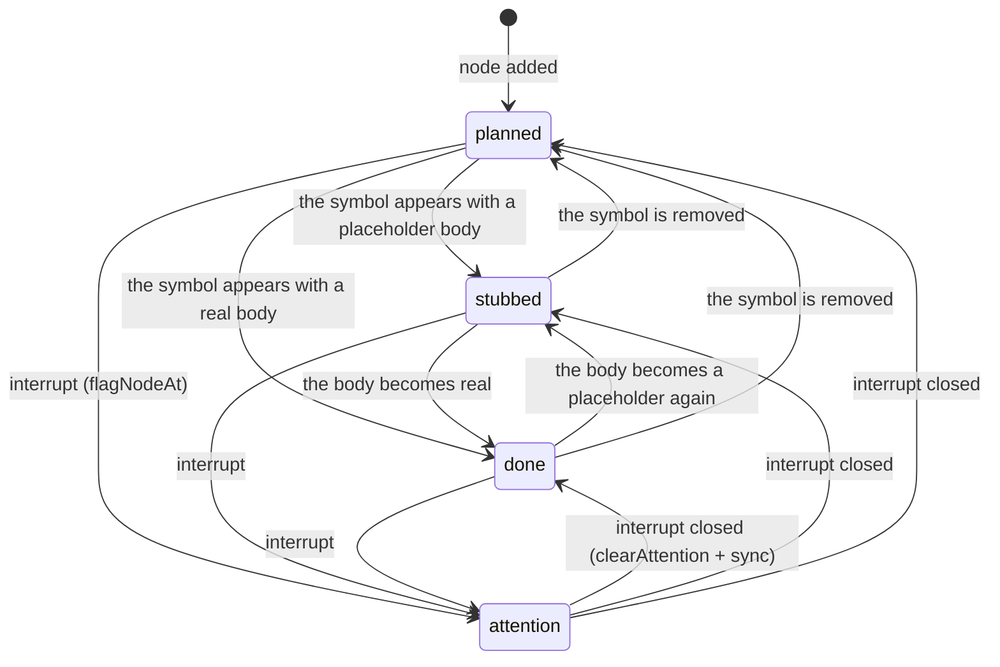

# 8. Graph model (`src/graph/`)

This document describes the implementation graph in the code. It tells how the LLM edits the graph and how the code sets the statuses. It also tells how the graph becomes text for prompts, for Jev and for Mermaid.

| Module | Function |
|---|---|
| `graph/model.ts` | The `GraphEditor`, the status sync with the outline, the attention flags and the text renderings. |
| `graph/order.ts` | The typing order of the nodes. The webview also uses it. |

Both modules are pure. The types are in `src/types.ts`. Refer to [Architecture](06-architecture.md#671-graph-types).

## 8.1 Limits

| Constant | Value | Effect |
|---|---|---|
| `MAX_NODES` | 60 | `add_nodes` refuses more nodes. |
| `MAX_EDGES` | 150 | `connect` refuses more edges. |
| `MAX_NOTES` | 8 | A node keeps a maximum of 8 notes. |
| `MAX_TEXT` | 600 | The maximum length of a description. |
| (inline) | 60 | The maximum length of a label and of an edge label. |
| (inline) | 400 | The maximum length of a signature. |
| (inline) | 300 | The maximum length of one note and of an attention reason. |

The function `clip(text, max)` trims the text. If the text is too long, it cuts the text and adds `…`. Thus a long value does not cause an error.

## 8.2 Input types

These types describe what the tools receive from the LLM. The values are not yet validated.

| Type | Fields |
|---|---|
| `NodeInput` | `id`, `kind`, `description`, and the optional `label`, `symbol`, `signature`, `notes`, `order` |
| `NodePatch` | All optional: `kind`, `label`, `symbol`, `signature`, `description`, `notes`, `order`, `status`, `attention` (an empty string clears it) |
| `NodeUpdate` | `id`, an optional `set` (`NodePatch`) and an optional `append_notes` |
| `EdgeInput` | `from`, `to`, `kind`, and an optional `label` |

## 8.3 Helpers

### 8.3.1 `emptyGraph(file, language, moduleString)` and `cloneGraph(g)`

`emptyGraph` makes a graph with no nodes, no edges and revision 0. `cloneGraph` makes a deep copy with `structuredClone`.

### 8.3.2 `slugify(raw)`

This function makes a node ID from any text:

1. It puts `_` between a lower-case letter or digit and an upper-case letter. `fetchIssues` becomes `fetch_Issues`.
2. It changes all letters to lower case.
3. It changes each group of other characters to one `_`. `Cache.get` becomes `cache_get`.
4. It removes `_` at the start and at the end.
5. It cuts the result at 48 characters. It removes a `_` at the new end.

### 8.3.3 Edit distance

The private function `editDistance(a, b)` computes the Levenshtein distance. This is the minimum number of single-character insertions, deletions and substitutions that change `a` into `b`. The editor uses it for the "Did you mean" hints.

## 8.4 `class GraphEditor`

The `GraphEditor` applies a batch of edits to a copy of a graph. The tools call it. Each method receives a list of items and returns one line for each item. A line starts with `ok:` or `error:`. The model reads these lines and can correct its mistakes in the same turn.

The constructor makes a deep copy of the graph. The editor never changes the graph in the store. The Assistant publishes the result (refer to [Assistant turns](12-assistant.md#121-turn-machinery)).

The editor records the IDs that it added, updated and removed, and the numbers of edges that it added, removed and relabeled.

### 8.4.1 Unknown IDs

`unknownId(id)` makes the error text for an ID that does not exist. It compares the ID with each node ID. Let $n$ be the length of the ID. If the edit distance is equal to or less than $\max(2, \lfloor n/3 \rfloor)$, the text gives the nearest ID as a hint. It always lists the IDs that exist. Example:

```text
unknown node id 'fetch_isues'. Did you mean 'fetch_issues'? Existing ids: parse_args, fetch_issues, main.
```

The update, remove and connect methods find a node by its exact ID first, and then by the slug of the given ID. Thus `Cache.get` finds `cache_get`.

### 8.4.2 `addNodes(inputs)`

For each input, the method does these steps:

1. It makes the ID with `slugify(id || symbol || label)`. If the ID is empty, it gives an error.
2. If a node with this ID exists, it gives an error. The error tells the model to use `update_nodes`.
3. If the kind is not in `NODE_KINDS`, it gives an error with the list of kinds.
4. If the description is empty, it gives an error.
5. If the graph has 60 nodes, it gives an error and stops the batch.
6. It makes the node. The label is the label, the symbol or the ID (maximum 60 characters). The order must be a positive number. The method rounds it. The status is `planned`.
7. It returns `ok: added 'id'.` If the ID changed, the line also tells the original ID: `ok: added 'cache_get' (id normalized from 'Cache.get').`

A failed item does not stop the other items, except for the node limit.

### 8.4.3 `updateNodes(updates)`

For each update, the method does these steps:

1. It finds the node. If the node does not exist, it gives the unknown-ID error.
2. It validates `set.kind` and `set.status` first. If one of them is not correct, it gives an error and changes nothing on this node.
3. It applies each field of `set`:
   - `kind`, `status`, `label`, `symbol`, `signature`, `notes`, `order` replace the old value. An empty `symbol` or `signature` removes it. An `order` of 0 or less removes it.
   - `description` replaces the old value only if the new value is not empty.
   - `attention` with text sets the reason and the status `attention`. An empty `attention` removes the reason. If the status was `attention`, it becomes `done` (if the node has a line in the code) or `planned`.
4. It adds `append_notes` to the notes and keeps the last 8.
5. If no field changed, it gives an error: "nothing to update".
6. It returns `ok: updated 'id' (fields).` The list of fields tells what changed, for example `(signature, notes+)`.

A node that the same batch added counts as added, not as updated.

### 8.4.4 `removeNodes(ids)`

For each ID, the method removes the node and all its edges. It returns `ok: removed 'id' and N edge(s).` If the same editor added the node before, the add and the remove cancel out in the summary.

### 8.4.5 `connect(edges)`

For each edge, the method does these steps:

1. It finds the two nodes. If one does not exist, it gives the unknown-ID error.
2. If the kind is not in `EDGE_KINDS`, it gives an error.
3. If the two nodes are the same node, it gives an error. Self-edges are not permitted.
4. If an edge with the same `from`, `to` and `kind` exists, it changes only the label. If the label is new, it returns `ok: relabeled …`. If not, it returns `ok: … already exists.`
5. If the graph has 150 edges, it gives an error and stops the batch.
6. It adds the edge and returns `ok: from -kind-> to.`

### 8.4.6 `disconnect(edges)`

For each item, the method removes all edges from `from` to `to`. If the item has a `kind`, it removes only edges of that kind. It accepts IDs and slugs. If no edge matches, it gives an error.

### 8.4.7 Results

| Member | Function |
|---|---|
| `graph` | The copy that the editor changes. The tools read it, for example for the totals after each call. |
| `changed` | `true` if the editor added, updated, removed or relabeled anything. |
| `summary()` | A `GraphChangeSummary`. |
| `result()` | A new copy of the graph. If the graph changed, the revision increases by 1 and `updatedAt` is the current time. |

### 8.4.8 Summaries

`emptySummary()` returns a summary with no changes. `describeSummary(s)` returns short text for the feed, for example `+4 nodes, ~1 updated, +3 edges`.

## 8.5 Status sync with the code

The code, not the LLM, sets the status of a symbol node (decision D2).



### 8.5.1 `findSymbol(node, symbols)`

This function finds the outline symbol of a node:

1. It takes the wanted name from `node.symbol`. The private function `symbolName` cleans this name:
   - It removes a keyword at the start: `def`, `class`, `function`, `const`, `let`, `var` or `async`.
   - It removes all text after `(`, `:`, `<` or a space.

   Thus `def Cache.get(self)` becomes `Cache.get`.
2. If the node has no symbol and its kind is a symbol kind, the wanted name is the label.
3. If a symbol has this exact `qualname`, the function returns it.
4. If not, it takes the last part of the dotted name. If exactly one symbol has this `name`, the function returns it.
5. In all other cases, it returns `undefined`.

The symbol kinds are `class`, `function`, `method`, `data`, `constant` and `test`.

### 8.5.2 `syncWithOutline(graph, outline)`

This function changes the graph in place and returns `true` if something changed. For each node, it does these steps:

1. It skips the node if the kind is not a symbol kind and the node has no symbol. Thus `external` and `step` nodes keep the status that the LLM gives them.
2. It finds the symbol.
3. It sets the status: `planned` if there is no symbol, `stubbed` if the symbol is a stub, and `done` in the other cases.
4. It keeps `attention` if the node has it.
5. It sets `line` to the 0-based symbol line, or removes it.

### 8.5.3 `flagNodeAt(graph, outline, line, why)`

This function flags the innermost node whose symbol contains the 0-based line. It sets `attention` to the reason (maximum 300 characters) and the status to `attention`. It returns the node ID, or `undefined` if no node contains the line. The Assistant calls it after an interrupt. The reason is the interrupt title.

### 8.5.4 `clearAttention(graph, outline, why?)`

This function removes the flags. With `why`, it removes only the flags with this reason. Without `why`, it removes all flags. It then calls `syncWithOutline`, so each node receives its correct status from the code. The controller calls it through the Assistant when an interrupt is resolved or dismissed.

### 8.5.5 `unplannedSymbols(graph, outline)`

This function returns the outline symbols that no node refers to. It ignores variables. The sync prompt lists them, so the LLM can add nodes for them.

## 8.6 Text renderings

### 8.6.1 `compactGraph(graph)`

This function makes readable text for the prompts and for the `get_graph` tool. The nodes are in typing order. The line numbers are 1-based. Example:

```text
nodes (3):
- parse_line [function, done, L5, order 1] symbol=parse_line
    sig: def parse_line(line: str) -> list[str]
    Split one line into lowercase words.
    • Strip punctuation with str.translate
- count_words [function, planned, order 2] symbol=count_words
    sig: def count_words(lines: Iterable[str]) -> Counter[str]
    Count words over all lines.
- counter [external, planned]
    collections.Counter
edges (2):
- count_words -calls-> parse_line
- count_words -uses-> counter
```

A flagged node has a line that starts with `⚠` and gives the reason. An empty graph gives "(empty graph)".

### 8.6.2 `graphForJev(graph)`

This function makes a small JSON value for the state that Jev receives:

```json
{
  "nodes": [{ "id": "parse_line", "kind": "function", "symbol": "parse_line",
              "signature": "def parse_line(line: str) -> list[str]",
              "status": "done", "purpose": "Split one line into lowercase words." }],
  "edges": ["count_words calls parse_line"]
}
```

### 8.6.3 `toMermaid(graph)`

This function makes a Mermaid `flowchart TD`:

- Each node is `id["label<br/><small>signature</small>"]:::status`.
- Each edge is `from -->|kind: label| to`.
- The function changes `"` to `#quot;`, `<` to `#lt;` and `>` to `#gt;` in labels. Thus a signature such as `list[str] -> dict<str, int>` does not break the Mermaid syntax.
- Four `classDef` lines give the statuses their style: a dashed border for `planned`, yellow for `stubbed`, green for `done` and red for `attention`.

## 8.7 Typing order (`order.ts`)

`orderedNodes(graph)` returns the nodes in the suggested typing order. The Steps tab, the number on each node in the graph, `compactGraph` and the prompts use this order.

The function does these steps:

1. It makes a dependency set for each node. For each edge, except `contains` edges and edges to unknown nodes, the `from` node depends on the `to` node. For example, if `main` calls `count_words`, the programmer types `count_words` first.
2. It does a depth-first search and adds each node after its dependencies (a post-order topological sort). A stack of the nodes in progress stops cycles.
3. It sorts the nodes. A node with an explicit `order` comes first, from the smallest order. Nodes without an order, and nodes with the same order, keep their topological rank.

The module imports only types. Thus the webview bundle can import it without the rest of the host code.
