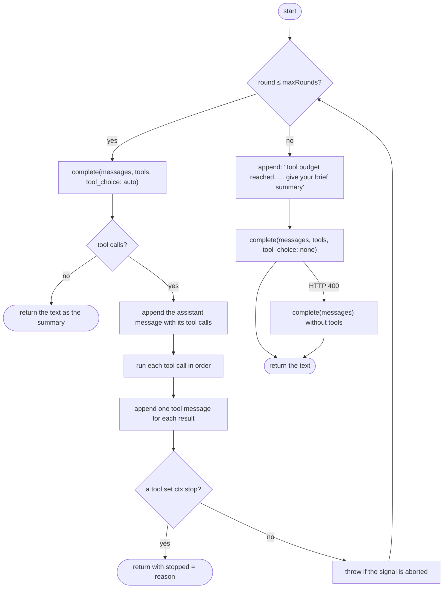

# 9. LLM agent (`src/llm/agent.ts`, `schema.ts`, `prompts.ts`)

This document describes how Assistive talks to the LLM. It covers the tool-call loop, the validation of tool arguments, the error messages, and the prompts. The tools themselves are in the [Tool reference](10-tool-reference.md).

## 9.1 The API format

Assistive uses the OpenAI Chat Completions format through the official `openai` npm package (version 7). Any server that implements this format and tool calls can work. The request goes to `{ASSISTIVE_LLM_BASE_URL}/chat/completions`.

Each tool is a `function` tool with a name, a description and a JSON Schema for the parameters. The model answers with `tool_calls` or with plain text. Assistive never sends `parallel_tool_calls`. If the model sends more than one tool call in one message, Assistive runs them one after the other, in the order of the message.

## 9.2 Data types

| Type | Fields | Description |
|---|---|---|
| `AgentTool<A>` | `name`, `description`, `parameters` (an object schema), `run(args, ctx)` | A tool. `run` returns text for the model. |
| `ToolContext` | `signal`, `stop` | `signal` stops the work. A tool sets `stop` to end the loop after the current round. |
| `AgentStep` | `tool`, `args`, `result`, `ok` | One tool call and its result. `ok` is `false` if the result starts with `error`. |
| `AgentResult` | `text`, `steps`, `rounds`, `stopped`, `usage` | The result of `run`. `text` is the final summary. `usage` counts the prompt and completion tokens. |
| `AgentOptions` | `messages`, `tools`, `maxRounds`, `signal`, `onStep`, `onText`, `maxResultChars` | The input of `run`. `onStep` receives each step as it occurs. `onText` receives the text of the current round as it streams. |
| `LlmError` | `message`, `status` | An error with a message that tells the programmer what to do. |

## 9.3 `class Llm`

### 9.3.1 Constructor

The constructor makes an `OpenAI` client with these options:

| Option | Value |
|---|---|
| `apiKey` | `ASSISTIVE_LLM_API_KEY` |
| `baseURL` | `ASSISTIVE_LLM_BASE_URL` |
| `timeout` | `ASSISTIVE_LLM_TIMEOUT_SECONDS` × 1000 |
| `maxRetries` | 2 (the SDK sends a request again after a connection error, a timeout, HTTP 429 or HTTP 5xx) |
| `defaultHeaders` | `ASSISTIVE_LLM_EXTRA_HEADERS` |
| `fetch` | A replacement `fetch` function. Only the tests use it. |

### 9.3.2 `complete(body, signal, onText?)`

This method sends one request. It adds `model` and `temperature` to the body.

Some compatible servers reject a part of the request with HTTP 400. The method then sends the request again without that part. The client never sends that part again:

| The error message contains | Part that the client stops to send |
|---|---|
| "temperature" | `temperature` |
| "tool_choice" | `tool_choice` |
| "stream" (only for a streaming request) | Streaming. The client sends normal requests after this. |

**Streaming.** If `onText` is given and streaming is on (`ASSISTIVE_LLM_STREAM`), the method uses the `stream()` helper of the SDK. The helper receives the reply as server-sent events. For each new part of the text, the method calls `onText` with all text so far. `stripThinkingPartial` hides `<think>` blocks, also a block that is not closed yet. At the end, the helper gives the complete reply with its tool calls, in the same form as a normal request.

All other errors go through `toLlmError`.

### 9.3.3 `text(messages, signal, json = false)`

This method asks for one plain answer without tools. With `json: true`, it adds `response_format: {type: "json_object"}`. If the server answers HTTP 400, the method sends the request again without `response_format`, because not all compatible servers support it. The method removes `<think>…</think>` blocks from the answer (function `stripThinking`). Some open models put their internal thoughts in these blocks.

The heartbeat uses `text` for LLM triage. The controller uses it for the connection test.

### 9.3.4 `run(opts)`: the tool-call loop



The loop does these steps:

1. It sends the messages and all tools with `tool_choice: "auto"`.
2. It adds the token usage of the reply to the totals.
3. If the reply has no message, it throws `LlmError("The LLM returned no message.")`.

   Before each round, the loop calls `onText("")`, so the panel shows only the text of the current round.
4. If the reply has no function tool calls, the text of the reply is the summary. The loop returns.
5. If not, it appends the assistant message with its `tool_calls` to the conversation.
6. It runs each tool call with `runTool`. It calls `onStep` for each step.
7. It appends one `tool` message for each call, with the `tool_call_id`. A result longer than 12 000 characters is cut and ends with "…(truncated)".
8. If a tool set `ctx.stop` (for example `stand_down`), the loop returns. The result has an empty text and `stopped` is the reason.
9. If the signal is aborted, the loop throws.
10. After `maxRounds` rounds (default 8), it appends a user message that asks for the summary. It sends the request with `tool_choice: "none"`. If the server does not accept `tool_choice`, it sends the request without tools, because "none" cannot be expressed. If the server answers HTTP 400, it sends the request again without tools.

The text of the message in step 10 is:

```text
Tool budget reached. Stop calling tools and give your brief summary of what changed now.
```

### 9.3.5 `runTool(byName, name, rawArgs, ctx)`

This private method runs one tool call. It never throws for a mistake of the model. It returns an error text that the model can act on.

| Condition | Result text |
|---|---|
| The tool does not exist | `error: there is no tool named 'x'. Available tools: …` |
| The arguments are not valid JSON | `error: arguments are not valid JSON (…). Send a JSON object.` |
| The arguments do not match the schema | `error: <all schema errors> Fix the arguments and call x again.` |
| The tool throws | `error: <message>` |
| The signal is aborted while the tool runs | The method throws, so the loop stops. |
| The model sent unknown fields | The result ends with `(note: ignored unknown field(s) …)`. |

Empty arguments (`""`) count as `{}`.

## 9.4 Error mapping (`toLlmError`)

The function `toLlmError(err, cfg)` changes SDK errors into messages that name the `.env` setting to examine.

| SDK error | Message | Status |
|---|---|---|
| `AuthenticationError`, `PermissionDeniedError` | The LLM API rejected the key (HTTP n). Check ASSISTIVE_LLM_API_KEY. | 401 or 403 |
| `NotFoundError` | The LLM API answered 404 at `<base>`: check ASSISTIVE_LLM_BASE_URL (it usually ends in /v1) and ASSISTIVE_LLM_MODEL='`<model>`'. | 404 |
| `RateLimitError` | The LLM API rate limit was reached (HTTP 429). Try again shortly. | 429 |
| `APIConnectionTimeoutError` | The LLM did not answer within N s. | none |
| `APIConnectionError` | Could not reach the LLM at `<base>`: … | none |
| `BadRequestError` that says the model does not support tools or function calls | The model '`<model>`' does not support tool calls (HTTP 400). Set ASSISTIVE_LLM_MODEL to a model with tool calling. | 400 |
| Other `APIError` | LLM error (HTTP n): … | n |
| `APIUserAbortError` or `AbortError` | The original error stays, so that the caller sees a cancel. | none |
| An `LlmError` | No change. | as before |

## 9.5 Schema validator (`schema.ts`)

The tools describe their parameters with a small subset of JSON Schema. The same schema goes to the model and to the validator.

### 9.5.1 Supported keywords

`type` (`object`, `array`, `string`, `integer`, `number`, `boolean`), `description`, `properties`, `required`, `additionalProperties`, `items`, `enum`, `minItems`, `maxItems`, `minimum`, `maximum`, `minLength`, `maxLength`.

### 9.5.2 `check(value, schema, path = "arguments")`

This function validates the value and makes small corrections. It returns `{value, errors, ignored}`. The error texts include the path, so the model can find the field. Example: `arguments.nodes[2].kind must be one of module, class, function, …; got 'func'.`

| Type | Validation | Correction |
|---|---|---|
| `object` | The value must be an object. Each `required` field must be present and not `null`. | A field with the value `null` is removed (an optional field sent as `null`). An unknown field is removed and added to `ignored` if `additionalProperties` is `false`. |
| `array` | `minItems` and `maxItems`. | A single scalar becomes a list of one item. A single object becomes a list of one item if the items are objects. |
| `string` | `enum`. `minLength` (after trim): "must not be empty". | A number or a boolean becomes a string. A string longer than `maxLength` is cut, without an error. |
| `integer`, `number` | The value must be finite. An integer must have no decimals. `minimum` and `maximum`. | A numeric string becomes a number. |
| `boolean` | The value must be `true` or `false`. | The strings `"true"` and `"false"` become booleans. |

The corrections help with small models. These models often send `"3"` for `3`, or one object for a list.

## 9.6 Prompts (`prompts.ts`)

### 9.6.1 Message structure

Each turn sends these messages:

1. A `system` message: the `SYSTEM` persona, a blank line, and the instructions of the mode.
2. For a chat turn only: up to 8 earlier user messages and chat replies.
3. A `user` message with the context. `contextBlock(sections)` makes it. Each section is `## Title` and its body. Empty sections are skipped. The function removes blank lines at the start and spaces at the end of a body. It keeps the spaces at the start of the first line, so numbered code stays aligned.

Example of a context block for a chat turn:

```text
## File
wc.py (python, 24 lines)

## Module docstring
Count the most common words in a text file and print them.

## Cursor
line 7, inside def parse_line(line: str) -> list[str]

## Outline
L5-7 def parse_line(line: str) -> list[str]

## Graph
nodes (4): …

## Message from the programmer
Add a helper that returns the top N words.
```

### 9.6.2 The persona (`SYSTEM`)

The system prompt makes the LLM a senior software engineer who pair-programs with a programmer who does not have much experience yet. Its rules are:

- The programmer types every line of code. The LLM never writes function bodies or code blocks longer than 3 lines. One-line API hints are permitted.
- The graph is the shared plan. The LLM changes it only through the graph tools and keeps the IDs stable.
- The LLM looks before it acts. It uses the read-only tools for facts. It never invents files, functions or library APIs. It prefers the libraries of the project.
- If the programmer probably does not know a concept, the LLM calls `recommend_resources` with 1 to 4 links that it is sure exist.
- The LLM follows the idioms and naming conventions of the language of the file, for example error values in Go and `Result` in Rust.
- The LLM is brief, concrete and kind, and addresses the programmer as "you".
- Line numbers in tools are 1-based.
- Each turn ends with a summary of 1 to 3 short sentences.

<details>
<summary>Full text of <code>SYSTEM</code></summary>

```text
You are Assistive, a senior software engineer pair-programming inside VS Code with a programmer who is still building their skills. Together you maintain an implementation graph for one source file: nodes are the pieces the programmer will type (functions, classes, methods, data types, constants, tests), the external APIs they rely on, or plain steps; edges say how they relate (calls, uses, contains, creates, reads, writes, returns, depends).

Ground rules:
- The programmer types every line of code. Never write the implementation for them: no function bodies and no code blocks longer than 3 lines. Give signatures, steps, invariants, pitfalls and the names of the right APIs. A one-line API hint such as `resp.raise_for_status()` is fine.
- The graph is the shared plan. Change it only through the graph tools, keep it faithful to the code that exists, and keep ids stable.
- Look before you act. Use the read-only tools when you need facts about the project; never invent files, functions or library APIs. Prefer the libraries and conventions the project already uses.
- When the programmer is likely missing a concept the work needs, call recommend_resources with the best 1-4 links (official documentation first, then well-known tutorials). Only use URLs you are confident exist.
- Follow the idioms and naming conventions of the file's language (for example error values in Go, Result in Rust, exceptions in Java and Python, snake_case or camelCase as the language expects).
- Be brief, concrete and kind. Address the programmer as "you".
- Line numbers in tool arguments and results are 1-based.
- End every turn with a plain-text summary of 1-3 short sentences: what changed and what the programmer should do next. Do not restate the whole graph.
```

</details>

### 9.6.3 Instructions for each mode

`instructionsFor(mode)` returns the instructions for `draft`, `chat`, `sync`, `heartbeat` or `struggling`.

| Mode | Instructions in short |
|---|---|
| `draft` | Read the docstring and the project context. Look at a maximum of 4 files. Add typically 4 to 15 nodes with symbols, typed signatures, descriptions, notes and an order. Connect them. Add `external` nodes for important libraries. Recommend resources if necessary. For an open design decision, choose a default, write it in the notes, and ask the programmer. End with the node to start with. |
| `chat` | Do what the message asks: change the plan, answer a question (with `point_to_code` for lines), or explain a concept with resources. If the message is only a question, do not change the graph. Answer first, then summarize the changes. |
| `sync` | Compare the outline, the graph and the edits. Update renamed symbols and changed signatures. Add nodes for new symbols. Add missing edges. Remove clearly abandoned nodes. Do not set statuses. If nothing changed, reply exactly "Graph already matches the code." |
| `heartbeat` | A fast monitor thinks that an interrupt can be necessary. Study the edits, the code at the cursor and the diagnostics. Interrupt only for a real problem. Unfinished code and style are not problems. If unsure, stand down. Flag or clear graph nodes if useful. |
| `struggling` | The monitor thinks that the programmer is stuck. If the concept is clear, recommend 1 to 3 pages and write one sentence of guidance. If the programmer is not stuck, reply only "No help needed." |

<details>
<summary>Full text of the mode instructions</summary>

**draft**

```text
Task: draft the implementation graph for this file from its module docstring.

1. Read the module docstring and the project context. If something essential is unclear, look at up to 4 files with the read-only tools; do not explore further.
2. Call add_nodes with everything the file needs, typically 4-15 nodes, one function/class/method per node (kind "step" only for work that is not a named symbol). Give each node the exact symbol to type, a concrete signature with types in the file's language, a one-to-two sentence description, and notes with the technical considerations (edge cases, errors, complexity, library calls, invariants). Set order so dependencies are typed first (1 = first).
3. Call connect with the edges between them. Add "external" nodes for the important libraries, services or project modules the file relies on.
4. If the plan needs a concept the programmer may not know, call recommend_resources.
5. If the docstring leaves a design decision open, choose a sensible default, record it in that node's notes, and ask_programmer with 2-4 options.
6. Finish with the brief summary, naming the node to start with.
```

**chat**

```text
Task: the programmer wrote to you about this file. Do what the message asks:
- change the plan with the graph tools (add, update, remove, connect, disconnect);
- answer a question directly, grounded in the code (read it when needed), with point_to_code for specific lines;
- explain a concept briefly and call recommend_resources when a good page would help.
If the message is only a question, answer it without changing the graph. Your final message is shown as your reply: answer first, then any change summary. Keep it short.
```

**sync**

```text
Task: bring the graph in line with the code the programmer has typed. Compare the outline, the graph and the recent edits:
- a symbol was renamed or its signature changed: update the node (symbol, signature) to match the code, unless the code is wrong, in which case add a note;
- a meaningful symbol exists that the graph does not plan: add a node for it and connect it;
- the code shows calls or uses between nodes that the graph lacks: connect them;
- a node is clearly abandoned in the code: remove it, only when that is obvious.
Statuses (planned, stubbed, done) follow the code automatically; do not set them. Do not lecture. Finish with one sentence, or exactly "Graph already matches the code." if you changed nothing.
```

**heartbeat**

```text
Task: heartbeat check. A fast monitor looked at the programmer's latest typing and thinks it may be worth interrupting them. You decide.

- Study the recent edits, the code around the cursor and the diagnostics below; read more of the file if needed.
- Interrupt (interrupt_programmer, once) only for a real problem: a typo or syntax error that will break, a logic error, misuse of an API, a missing edge case that will bite, a security issue, code drifting from the plan in a way that matters, or a clearly better approach they should know before going further.
- Code that is simply unfinished, or still being typed, is not a problem. Style preferences are not worth an interruption. When unsure, stand_down.
- If nothing deserves an interruption, call stand_down with a short reason.
- You may flag a graph node with update_nodes (set.attention) about the problem, or clear an old flag that the code has resolved (set.attention = "").
- If the programmer looks stuck on a concept, recommend_resources.
```

**struggling**

```text
Task: the monitor thinks the programmer may be stuck on a concept in what they are typing now. Look at the recent edits and the code around the cursor. If you can tell which concept, call recommend_resources with the best 1-3 pages for exactly that, and finish with one sentence of guidance (no code). If they are not actually stuck, reply only "No help needed."
```

</details>

### 9.6.4 LLM triage prompt (`TRIAGE_JSON_SYSTEM`)

With `ASSISTIVE_TRIAGE=llm`, the heartbeat asks the LLM for a JSON verdict instead of Jev. The prompt asks for one JSON object with these fields:

| Field | Range | Description |
|---|---|---|
| `interrupt` | 0 to 1 | The probability that the latest change has a real problem worth an interrupt now. |
| `issue` | `none`, `typo`, `syntax`, `logic_error`, `api_misuse`, `better_implementation`, `missing_edge_case`, `deviates_from_graph`, `security` | The kind of problem. |
| `severity` | 0 to 3 | 0 cosmetic, 1 minor, 2 fix before you continue, 3 a bug or a block. |
| `graph_outdated` | 0 to 1 | The probability that the graph no longer agrees with the code. |
| `struggling` | 0 to 1 | The probability that the programmer is stuck on a concept. |

The user message is the same JSON state that Jev receives. Refer to [Jev and the heartbeat](11-jev-and-heartbeat.md#116-the-state-that-jev-receives).
