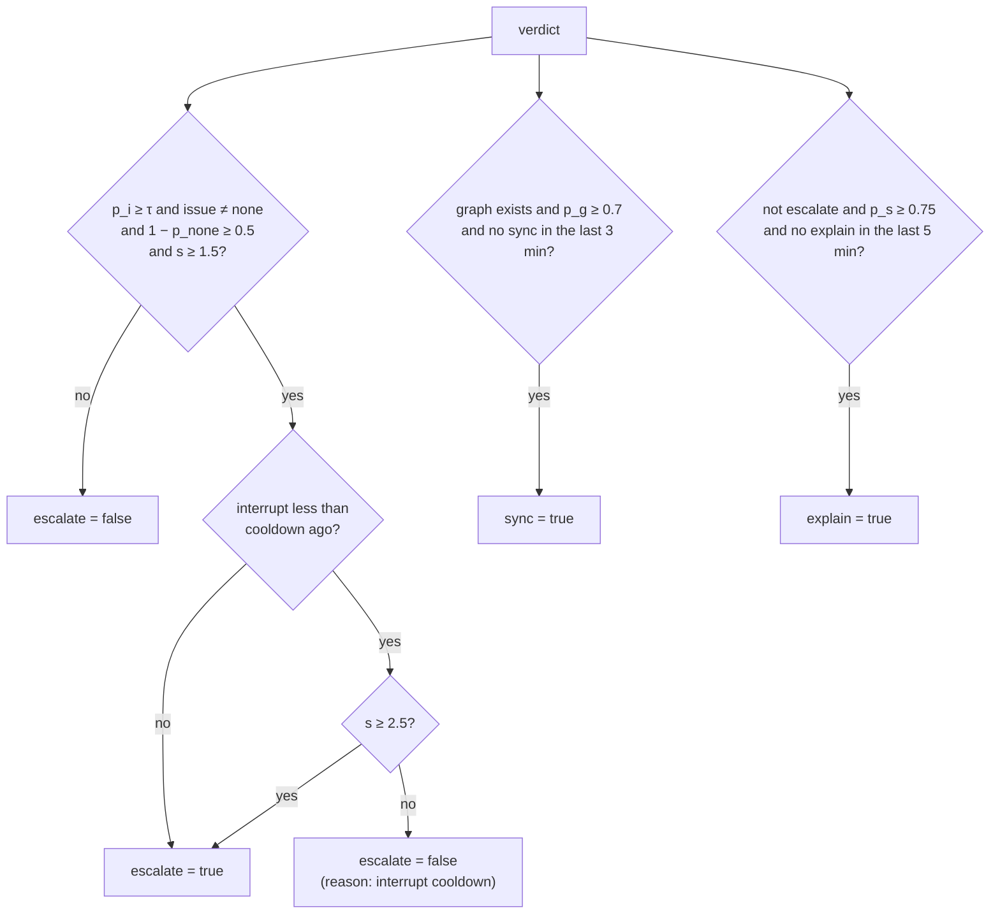

# 11. Jev and the heartbeat (`src/llm/jev.ts`, `src/heartbeat/`)

This document describes the heartbeat. The heartbeat watches the code of the programmer at a calm interval. Jev, a fast System One model, examines each change first. The LLM examines the change only when the answers from Jev justify it.

| Module | Function |
|---|---|
| `llm/jev.ts` | The Jev client in the official request format. |
| `heartbeat/policy.ts` | The Jev questions, the verdicts, the decision rules, the time rules of a beat and the interrupt reconcile. Pure. |
| `heartbeat/Heartbeat.ts` | The runner: the timer, one beat, the triage, and the calls to the Assistant. |

## 11.1 The Jev request format

Jev answers typed questions about a state with calibrated probabilities. One request can ask many questions. Jev answers them in parallel.

**Request:**

```http
POST {ASSISTIVE_JEV_BASE_URL}/systemone
Authorization: Bearer <ASSISTIVE_JEV_API_KEY>
Content-Type: application/json
Accept: application/json

{
  "model": "jev-latest",
  "state": { … any JSON value or a string … },
  "questions": {
    "<name>": { "type": "noul" | "choice" | "score", "instructions": "…", "criteria": … }
  }
}
```

**Question types:**

| Type | `criteria` | Answer |
|---|---|---|
| `noul` | Optional: `{ "true": "…", "false": "…" }` | `{ "type": "noul", "noul": p }`: the probability that the answer is true. |
| `choice` | Required: `{ "<option>": "<description>", … }` | `{ "type": "choice", "choice": "<option>", "probabilities": { "<option>": p, … }, "confidence": c }` |
| `score` | Required: a list of level descriptions, from level 0 up | `{ "type": "score", "score": s, "probabilities": { "0": p0, "1": p1, … }, "confidence": c }` |

For a score, $s$ is the probability-weighted mean of the 0-based level numbers:

$$s = \sum_{k=0}^{n-1} k \, p_k$$

Thus $s$ can fall between two levels. For example, $p_2 = 0.5$ and $p_3 = 0.5$ give $s = 2.5$.

**Response:**

```json
{
  "model": "jev-1.13.0",
  "answers": { "<name>": { … }, … },
  "usage": { "input_tokens": 420, "output_tokens": 12 }
}
```

> **Note:** The request format follows the public documentation and examples of TypeSafe AI. The tests use a fake server that follows this format. The live service was not available from the build environment.

## 11.2 The Jev client (`jev.ts`)

### 11.2.1 `JevClient.ask(state, questions, signal?)`

This method does these steps:

1. It makes a timeout signal with `AbortSignal.timeout(ASSISTIVE_JEV_TIMEOUT_SECONDS)`. If the caller gives a signal, it combines the two signals with `AbortSignal.any`.
2. It sends the request to `endpoint` (`{base}/systemone`) with `fetch`.
3. If the request fails because of the timeout, it throws `JevError("Jev did not answer within N s.")`. For a different failure, it throws `JevError("Could not reach Jev at …: …")`.
4. If the HTTP status is not 2xx, it throws a `JevError` with the text of `describeHttpError` and the status.
5. It parses the body as JSON. If this fails, it throws `JevError("Jev returned a response that is not JSON: …")`.
6. It reads `body.answers`. If that is absent, it reads `body.results`.
7. For each question that it asked, it calls `parseAnswer`. It ignores answers to questions that it did not ask.
8. If no answer is usable, it throws `JevError("Jev's response had no answers for the questions asked.")`.
9. It returns `{model, answers, usage, latencyMs}`. The latency is the time from the start of the request to the parsed reply.

### 11.2.2 `describeHttpError(status, contentType, text)`

| Status | Message |
|---|---|
| 401 or 403, with an HTML body | Jev's edge firewall rejected the request (HTTP n); code that looks like shell commands can trigger this. |
| 401 or 403, other body | Jev rejected the API key (HTTP n). Check ASSISTIVE_JEV_API_KEY. |
| 429 | Jev rate limit reached (HTTP 429); the heartbeat will retry later. |
| Other | Jev error HTTP n: `<detail>`. The detail is `error.message`, `error` or `message` from a JSON body, or the first 200 characters of the body. |

The firewall case is known from the TypeSafe SDK issue tracker. A state that looks like a shell command can cause an HTML 403 page from the edge firewall.

### 11.2.3 `parseAnswer(question, raw)`

This function normalizes one answer. It accepts small variations of the format, so that a small format change does not stop the heartbeat.

| Type | Accepted input | Output |
|---|---|---|
| `noul` | `noul`, `probability`, `p` or `value`. A boolean becomes 1 or 0. A bare number is accepted. | The probability, kept between 0 and 1. |
| `choice` | `probabilities` as an object or as a list. `choice`, `answer`, or the option with the highest probability. | `choice`, `probabilities`, and `confidence` (the default is the probability of the choice). |
| `score` | `probabilities` as an object or as a list. `score` or `value`. If both are absent, the function computes $\sum k \, p_k$. | `score`, `probabilities`, `confidence`. |

It returns `undefined` if the answer is absent or has no usable value.

### 11.2.4 Helpers

`noul(result, name)`, `choice(result, name)` and `score(result, name)` return one answer of the correct type, or `undefined`.

## 11.3 The five questions (`JEV_QUESTIONS`)

Each beat asks Jev these five questions in one request.

| Name | Type | Question | Criteria |
|---|---|---|---|
| `interrupt` | `noul` | Is there a real problem in what the programmer just typed that is worth an interrupt right now? Unfinished code and style preferences are not problems. | true: a concrete mistake, or a clearly better approach, that the programmer must hear about now. false: the code is correct, still in progress, or the problem is too small. |
| `issue` | `choice` | What is the most important problem in the latest change? | The options of `ISSUE_CRITERIA` except `other` (refer to the next table). |
| `severity` | `score` | How severe is that problem for the program and for the progress of the programmer? | The four `SEVERITY_LEVELS`. |
| `graph_outdated` | `noul` | Has the code moved away from the plan: symbols renamed, added or abandoned, or different signatures? | none |
| `struggling` | `noul` | Does the programmer seem stuck on a concept: the same lines rewritten again and again, trial and error, contradictory attempts? | none |

**Issue options (`ISSUE_CRITERIA`):**

| Option | Description that Jev receives |
|---|---|
| `none` | No real problem: the code is fine, or simply unfinished and still being typed. |
| `typo` | A misspelled identifier, attribute, key or string that will make the code fail. |
| `syntax` | A syntax error: the code will not parse. |
| `logic_error` | Wrong logic: off-by-one, inverted condition, wrong variable, wrong order of operations. |
| `api_misuse` | A library or language API used incorrectly: wrong arguments, ignored return value or error, deprecated call. |
| `better_implementation` | It works, but a clearly simpler, faster or more idiomatic approach exists. |
| `missing_edge_case` | An input or failure case (empty, None/null, error response, timeout) is not handled. |
| `deviates_from_graph` | The code departs from the agreed implementation plan in a way that matters. |
| `security` | A security problem: injection, unsafe deserialization, secrets in code, missing validation. |
| `other` | (Not offered to Jev.) Another concrete problem. An unknown issue name becomes `other`. |

**Severity levels (`SEVERITY_LEVELS`):**

| Level | Description |
|---|---|
| 0 | Cosmetic; can be ignored |
| 1 | Minor; mention at the next natural pause |
| 2 | Should be fixed before moving on |
| 3 | Will cause a bug or blocks progress; interrupt now |

## 11.4 Verdicts and decision rules (`policy.ts`)

### 11.4.1 `TriageVerdict`

A verdict is the result of the triage in one common form, from Jev or from the LLM.

| Field | Description |
|---|---|
| `source` | `jev` or `llm`. |
| `interrupt` | $p_i$: the probability that an interrupt is worth it now. |
| `issue` | The most important issue kind, or `none`. |
| `issueProbability` | The probability that there is some issue: $1 - p_\varnothing$. |
| `severity` | $s \in [0, 3]$. |
| `graphOutdated` | $p_g$: the probability that the graph is out of date. |
| `struggling` | $p_s$: the probability that the programmer is stuck. |
| `latencyMs` | The Jev latency. |

### 11.4.2 `verdictFromJev(result)`

This function makes a verdict from the Jev answers:

- `interrupt`, `graphOutdated` and `struggling` come from the `noul` answers. The default is 0.
- `issue` is the choice. An unknown choice becomes `other`. If there is no answer, the issue is `none`.
- `severity` is the score. The default is 0.
- `issueProbability` is:
  - $1 - p_\varnothing$, if the answer has a probability for `none`;
  - else the confidence of the choice (default 0.5), if the choice is not `none`;
  - else $1 - $ the confidence of the choice (default 1, which gives 0).

### 11.4.3 `verdictFromLlmJson(text)`

With LLM triage, the reply can contain prose or a code fence around the JSON. `firstJsonObject(text)` finds the first balanced `{…}` that parses as JSON:

1. It starts at each `{` in the text, from the left.
2. It counts the braces. It ignores braces inside strings, and characters after a backslash in a string.
3. When the count returns to 0, it tries `JSON.parse`. If the parse succeeds, it returns the text. If not, it continues at the next `{`.

The verdict then has `issueProbability` 0 for `none` and 1 for all other issues. The function keeps the probabilities between 0 and 1 and the severity between 0 and 3. It returns `undefined` if there is no JSON object.

### 11.4.4 `decide(verdict, config, state, now, hasGraph)`

This function decides what a beat does. It returns three flags and a list of reasons for the log.



**Escalation.** The LLM examines the change if all of these conditions are true:

- $p_i \ge \tau$, where $\tau$ is `ASSISTIVE_INTERRUPT_THRESHOLD` (default 0.65);
- the issue is not `none`;
- $1 - p_\varnothing \ge 0.5$;
- $s \ge 1.5$ (`MIN_SEVERITY`);
- the last interrupt is older than the cooldown (`ASSISTIVE_INTERRUPT_COOLDOWN_SECONDS`, default 90 s), **or** $s \ge 2.5$ (`URGENT_SEVERITY`);
- the programmer dismissed fewer than two interrupts of this issue kind in the session (`DISMISSALS_TO_QUIET`), **or** $s \ge 2.5$.

**Sync.** The LLM syncs the graph if all of these conditions are true:

- the file has a graph with nodes;
- $p_g \ge$ `ASSISTIVE_GRAPH_SYNC_THRESHOLD` (default 0.7);
- the last sync from a beat is older than 3 minutes (`SYNC_COOLDOWN_MS`).

**Explain.** The LLM recommends resources if all of these conditions are true:

- the beat does not escalate;
- $p_s \ge$ `ASSISTIVE_EXPLAIN_THRESHOLD` (default 0.75);
- the last explanation from a beat is older than 5 minutes (`EXPLAIN_COOLDOWN_MS`).

A beat can escalate and sync. A beat never escalates and explains at the same time, so the programmer receives only one message.

### 11.4.5 `beatDue(timing, pauseMs = 2000)`

A beat is due if all of these conditions are true:

- the editor window has the focus;
- there was at least one edit after the last beat;
- $t_\text{now} - t_\text{last beat} \ge$ the interval;
- $t_\text{now} - t_\text{last edit} \ge 2\,\text{s}$.

### 11.4.6 `describeVerdict(verdict)`

This function makes one line for the log and for the tooltip of the **♥** pill, for example:

```text
jev: interrupt 0.93 · typo · severity 3.0 · graph 0.05 · stuck 0.05
```

### 11.4.7 `reconcileInterrupts(feed, lines)`

This function finds out what happened to each open interrupt after the programmer changed the file. It examines only interrupts with the status `open` and a `lineText`.

1. If the trimmed text at the stored line is the same as the trimmed `lineText`, nothing changed.
2. If not, it searches the lines near the stored line, at distances 1 to 30, below and then above. If a line has the same trimmed text (and the text is not empty), the interrupt moved to that line.
3. If no line matches, the interrupt is resolved.

It returns a list of `{id, line?, resolved}`. The controller applies the list (refer to [Controller](15-controller.md#155-interrupts)).

## 11.5 The heartbeat runner (`Heartbeat.ts`)

### 11.5.1 Dependencies (`HeartbeatDeps`)

The controller gives the runner these dependencies: `config()`, `enabled()`, `jev()`, `llm()`, `active()` (the file in the active editor), `focused()`, `edits`, `store`, `assistant`, `outlineOf()`, `onBeat(report)`, `log(message)` and an optional `now()` for tests.

### 11.5.2 The timer

`start()` starts a timer that calls `tick()` every 3 seconds (`TICK_MS`). `tick()` returns at once in these conditions:

- a beat is in progress;
- the heartbeat is disabled;
- no supported file is active;
- the heartbeat waits after failures (refer to [11.5.7](#1157-backoff-after-failures)).

If not, it calls `beatDue` with the statistics of the `EditTracker`. If a beat is due, it calls `beat(handle, {auto: true})`.

### 11.5.3 `beat(handle)`

One beat does these steps:

1. If no file is given, or a beat is in progress, it returns `undefined`.
2. It sets the `beating` flag and records the time of the beat for this file.
3. It takes a copy of the text.
4. For an automatic beat, it calls `edits.meaningfulChange`. If only whitespace or blank lines changed, it moves the baseline and stops. The outcome is `skipped` with the action "only whitespace changed". Jev receives no request.
5. It calls `assistant.localSync` to update the statuses from the outline.
6. It computes the diff since the last beat (maximum 4000 characters).
7. It runs the triage (refer to [11.5.4](#1154-triage)).
8. It calls `edits.beat(file, text)`. The next diff starts from the text that this beat examined. Thus typing during a long escalation goes into the next beat.
9. If there is no verdict (triage `off`), the outcome is `skipped`. If there is a verdict, the failure count goes back to 0.
10. It calls `decide` and writes the verdict and the reasons to the log.
11. If `escalate` is true and the LLM is configured, it calls `assistant.heartbeat`. If the outcome is `interrupted`, it records the time of the interrupt.
12. If `sync` is true, it records the time and calls `assistant.sync(handle, "after a heartbeat")`. A failure goes to the log only.
13. If `explain` is true, it records the time and calls `assistant.struggling`. A failure goes to the log only.
14. If an error occurs, the outcome is `error` and the report has the message. The heartbeat starts to wait (refer to [11.5.7](#1157-backoff-after-failures)).
15. At the end, it clears the `beating` flag and calls `onBeat(report)`.

The **♥ Check now** button calls `beat` directly. Thus it ignores the interval, the pause, the focus, the edit count, the whitespace rule and the wait after failures.

### 11.5.4 Triage

| `ASSISTIVE_TRIAGE` | Behavior |
|---|---|
| `off` | No triage. The beat is `skipped`. |
| `jev` | If Jev is configured: `jev.ask(state, JEV_QUESTIONS)` and `verdictFromJev`. If not, the beat fails. The message is "Jev is not configured (set ASSISTIVE_JEV_API_KEY, or ASSISTIVE_TRIAGE=llm)." |
| `llm` | If the LLM is not configured, no triage. If not, `llm.text([TRIAGE_JSON_SYSTEM, JSON state], json: true)` and `verdictFromLlmJson`. A reply without JSON gives the error "LLM triage was not JSON: …". |

### 11.5.5 `noteInterrupt(file)` and `noteDismissed(file, issue)`

The controller calls `noteInterrupt` when a new interrupt shows. It sets the time of the last interrupt, so that the cooldown starts.

The controller calls `noteDismissed` when the programmer clicks **Got it**. It counts the dismissals of each issue kind in `PolicyState.dismissed`. After two dismissals of a kind, `decide` escalates that kind only if it is urgent. The count is kept only for the session.

### 11.5.6 `BeatReport`

| Field | Description |
|---|---|
| `file` | The store key (the absolute path). |
| `at` | The time of the beat. |
| `verdict` | The verdict, if the triage ran. |
| `outcome` | `interrupted`, `stood_down`, `no_action`, `skipped` or `error`. |
| `actions` | The reasons from `decide`. |
| `error` | The error message, if the outcome is `error`. |

The controller shows the last report in the status of the panel.

### 11.5.7 Backoff after failures

A failed beat (for example, Jev is not available) increases a failure count $n$. The automatic beats then wait for

$$\min(10\ \text{min},\ \text{interval} \times 2^{n})$$

With the default interval of 45 s, the waits are 90 s, 180 s, 360 s, and then 10 minutes (`MAX_BACKOFF_MS`). The log shows each wait. A beat with a verdict sets $n$ to 0.

## 11.6 The state that Jev receives

`Heartbeat.jevState(handle, text, outline, diff)` makes a small, structured state. It focuses on the latest change.

| Field | Content |
|---|---|
| `file` | The workspace-relative path. |
| `language` | The language ID. |
| `module_docstring` | The module docstring, maximum 1200 characters. |
| `plan` | `graphForJev(graph)`, or `null` if there is no graph. |
| `cursor` | `{line, scope}`: the 1-based cursor line and the signature of the symbol that contains the cursor, or "module level". |
| `current_scope_code` | The code of the symbol that contains the cursor, with 1-based line numbers. Without a symbol, 15 lines above and below the cursor. A symbol longer than 60 lines is cut to a window of about 60 lines at the cursor. |
| `recent_change` | The diff since the last beat, maximum 3000 characters, or "(no change)". |
| `diagnostics` | A maximum of 10 diagnostics of the file, in the form `L12 error: message`. |
| `recent_conversation` | The last 4 user and assistant messages, maximum 300 characters each. |
| `open_interrupts` | The titles of the open interrupts. |

Example:

```json
{
  "file": "wc.py",
  "language": "python",
  "module_docstring": "Count the most common words in a text file and print them.",
  "plan": { "nodes": [ … ], "edges": [ "count_words calls parse_line" ] },
  "cursor": { "line": 7, "scope": "def parse_line(line: str) -> list[str]" },
  "current_scope_code": "5| def parse_line(line: str) -> list[str]:\n6|     \"\"\"Split one line.\"\"\"\n7|     return [w.lowr() for w in line.split()]",
  "recent_change": "@@ new lines 5-7 @@\n  5 | def parse_line(line: str) -> list[str]:\n  6 |     \"\"\"Split one line.\"\"\"\n-   |     pass\n+ 7 |     return [w.lowr() for w in line.split()]",
  "diagnostics": [],
  "recent_conversation": [ "user: Add a helper that returns the top N words." ],
  "open_interrupts": []
}
```
