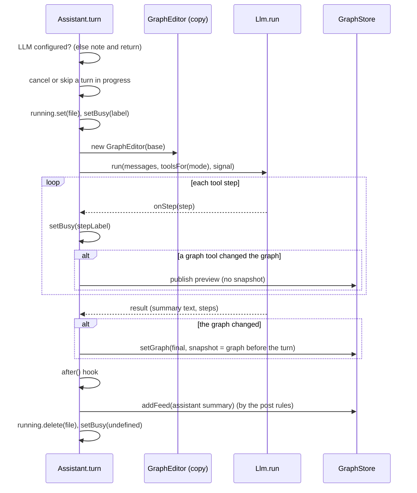

# 12. Assistant turns (`src/assistant/Assistant.ts`)

This document describes the `Assistant` class. The Assistant runs each **turn**: one call of the LLM agent loop for one file. There are six kinds of turn: draft, chat, sync, heartbeat, struggle and explain. The Assistant has no `vscode` import. The unit tests run it against fake OpenAI and Jev servers.

## 12.1 Turn machinery

### 12.1.1 Inputs

**`FileHandle`** describes the file of a turn:

| Member | Description |
|---|---|
| `key` | The store key: the absolute path. |
| `file` | The path relative to `ws.root`. The model sees this path. |
| `ws` | The `WorkspaceAccess`. |
| `language` | The language ID. |
| `text()` | The live text, with unsaved edits. |
| `cursorLine()` | The 0-based cursor line, if the file is in a visible editor. |

**`AssistantDeps`** are the dependencies that the controller gives: `llm()`, `store`, `edits`, `outlineOf()`, `checkLinks()`, `setBusy(file, label)` and `log(message)`.

### 12.1.2 One turn at a time for each file

The Assistant runs a maximum of one turn for each file at a time. It uses three maps:

- `running`: the turn in progress, with its mode, its `AbortController` and a `silent` flag.
- `locks`: a queue for each file. The private method `exclusive(file, fn, silent)` runs `fn` only after the turns before it are done.
- `waiting`: the number of programmer requests that wait for the file.

The rules are:

1. A programmer request (draft, chat, sync, explain) waits in the queue for the request before it. Thus a message that you send during a draft does not cancel the draft. The message runs after the draft and sees the new graph.
2. A programmer request cancels a heartbeat or struggle turn in progress (the abort reason is `preempted`). The programmer comes first.
3. A **silent** turn (heartbeat and struggle) starts only if no turn runs and no request waits. If a request starts to wait before the silent turn calls the LLM, the silent turn stops.

The public members are:

| Member | Function |
|---|---|
| `isBusy(file)` | `true` if a turn runs or waits for the file. |
| `cancel(file, onlyMode?, reason = "user")` | Aborts the turn in progress. With `onlyMode`, only a turn of that mode. The **Stop** button uses the reason `user`. |

### 12.1.3 The private method `turn(handle, mode, content, options)`

All turns use this method. It does these steps:



1. If the LLM is not configured, it returns. For a turn that is not silent, it first adds a warning note to the feed.
2. If the turn is silent and a programmer request waits, it returns (refer to [12.1.2](#1212-one-turn-at-a-time-for-each-file)).
3. It records the turn in `running` and sets the busy label, for example "Drafting the graph…".
4. It keeps the graph that is in the store before the turn (`before`).
5. It makes a `GraphEditor` on a copy of the base graph. For a draft, it also sets the module string of the graph.
6. It makes the tool environment (`ToolEnv`). The environment gives the tools the live text, the outline cache, the editor and the edit tracker. It also gives the link check and an `emit` function for the feed.
7. It calls `llm.run` with:
   - a system message: `SYSTEM`, a blank line, and the instructions of the mode;
   - the history messages (chat only);
   - a user message with the context block;
   - the tools of the mode;
   - the abort signal.
8. For each tool step, `onStep` does three things:
   - It changes the busy label (refer to [12.1.4](#1214-busy-labels)).
   - It writes failed tool calls to the log.
   - If a graph tool (`add_nodes`, `update_nodes`, `remove_nodes`, `connect`, `disconnect`) changed the graph, it publishes a **live preview**. The preview is `editor.result()` with `syncWithOutline`. The store saves it without an undo snapshot. Thus the programmer sees the graph grow while the LLM works.
9. When the loop ends, it sets `finished`. A preview that arrives late does not overwrite the final graph.
10. If the graph changed, it computes the final graph and syncs it with a fresh outline. It saves the graph with `before` as the undo snapshot. If the file had no graph before the turn, the snapshot is an empty graph. Thus one turn makes one undo step, also after many previews, and also a first draft can be undone.
11. It runs the `after` hook. For a draft, the hook sets the `graph_created` baseline of the `EditTracker`.
12. It adds the summary to the feed, by the post rules (refer to [12.1.5](#1215-post-rules)).
13. It writes the rounds, the tool calls and the tokens to the log.
14. At the end, it clears the busy label. It removes the turn from `running` if the entry is still for this turn.

**Failure.** If the loop throws:

- The method restores the graph before the turn, if previews changed it (a rollback).
- If the turn was cancelled, it writes "cancelled" to the log and returns `undefined`. If the programmer stopped a turn that is not silent, it adds the note "Stopped. The graph is as it was before.".
- If not, it writes the error to the log and throws the error again. For a turn that is not silent, it also adds an error note to the feed. The controller marks the LLM pill red.

### 12.1.4 Busy labels

The function `stepLabel(step)` changes the busy label during a turn:

| Tool | Label |
|---|---|
| `read_file`, `get_file_outline` | Reading `<path>`… (or "Reading the file…") |
| `search_code` | Searching for `<query>`… |
| Graph tools | Updating the graph… |
| `recommend_resources` | Checking links… |
| Other tools | No change |

### 12.1.5 Post rules

The rules decide if the summary of the LLM goes into the feed:

| Turn | Post the summary if |
|---|---|
| Silent (heartbeat, struggle) | The graph changed, **or** a tool showed something and the text is not empty and does not start with "No help needed". |
| Sync | The graph changed, **or** the programmer asked for the sync. An automatic sync that changes nothing stays quiet. |
| Draft, chat | Always. |

If the text is empty, the feed shows "Updated the graph (+2 nodes, +1 edge)." or "Done.". The assistant item has the `changes` summary if the graph changed.

## 12.2 Draft

`draft(handle)` drafts or redrafts the graph from the module docstring.

1. It computes the outline. If there is no module docstring, it adds a warning note with an example docstring and returns.
2. It makes the project summary (refer to [Code analysis](07-code-analysis.md#758-projectsummaryws-file-current-outlineof)). If this fails, the section is "(project context unavailable: …)".
3. If the file has a graph with nodes, the turn is a **redraft**. The context then includes the graph and this instruction: "The docstring changed since this graph was drafted. Revise the graph to match it: keep the ids of nodes that still fit, update or remove the others, add what is missing."
4. It builds the context with these sections: File, Module docstring, Current outline (with docstrings), Existing graph (redraft only), Project context.
5. It runs the turn in `draft` mode. The base is the graph that exists, or an empty graph. The busy label is "Drafting the graph…" or "Redrafting the graph…".
6. After the turn, the `graph_created` baseline is the text at the start of the draft.

The context gives the model all the facts that it needs, so a draft usually takes 2 or 3 rounds (decision D4).

## 12.3 Chat

`chat(handle, message)` acts on a message from the programmer.

1. It adds the message to the feed as a `user` item at once. Thus the programmer sees it also while an earlier turn runs.
2. It waits in the queue of the file. This cancels a heartbeat turn in progress.
3. It builds the context: File, Module docstring, Cursor (for example "line 7, inside def parse_line(…)"), Outline, Graph (or "(no graph yet: add nodes if the message asks for a plan)"), Diagnostics, Message from the programmer.
4. It adds the history: up to 8 earlier `user` items and `assistant` items of mode `chat`. It stops before the current message. Thus a message that waits in the queue is not in the history of an earlier message.
5. It runs the turn in `chat` mode with the busy label "Thinking…".

## 12.4 Sync

`sync(handle, why = "requested")` brings the graph in line with the code.

1. If there is no graph, it adds the note "There is no graph to sync yet. Draft one first." and returns.
2. It makes a copy of the graph and calls `syncWithOutline`.
3. It finds the symbols that no node plans (`unplannedSymbols`).
4. It builds the context with these sections:
   - File (with the reason);
   - Outline (with docstrings);
   - Graph;
   - Symbols in the code that no node plans;
   - Edits since the graph was created (maximum 6000 characters).
5. It runs the turn in `sync` mode with the busy label "Syncing the graph with your code…". For an automatic sync (`why` is not "requested"), the turn is quiet if nothing changed.

## 12.5 Heartbeat escalation

`heartbeat(handle, verdict, recentDiff)` lets the LLM decide if it interrupts. It returns `interrupted`, `stood_down` or `no_action`.

1. If a turn runs or waits for the file, it returns `no_action`.
2. It builds the context:
   - File;
   - Monitor verdict (the `describeVerdict` line);
   - Cursor;
   - Code around the cursor (`scopeCode`);
   - Recent edits (since the last heartbeat);
   - Diagnostics;
   - Graph;
   - Already reported (do not repeat these): up to 6 interrupts that are not resolved.
3. It runs a silent turn in `heartbeat` mode with the busy label "Heartbeat: taking a closer look…".
4. If a call of `interrupt_programmer` succeeded, it finds the last open interrupt in the feed and calls `flag`. It returns `interrupted`.
5. If the loop stopped (for example with `stand_down`), it returns `stood_down`.
6. In all other cases, it returns `no_action`.

### 12.5.1 `flag(handle, item)` and `unflag(handle, item)`

`flag` copies the graph, calls `flagNodeAt` with the line and the title of the interrupt, and saves the copy without an undo snapshot. `unflag` does the same with `clearAttention` and the title. The controller calls `unflag` when an interrupt is resolved or dismissed.

## 12.6 Feed output and duplicate interrupts

The tools call `emit(item)`. The private method `emit(file, item)` adds the item to the store. For an interrupt, it first looks for a duplicate. A duplicate is an interrupt that:

- is not resolved (it is open or dismissed);
- has the same issue kind;
- has the same trimmed line text.

If a duplicate exists, the method does not add the interrupt and returns `false`. The tool then tells the model that the problem was already reported. Thus a dismissed problem on an unchanged line never comes back (invariant I3).

## 12.7 Struggle

`struggling(handle, verdict, recentDiff)` offers resources when the heartbeat thinks that the programmer is stuck.

1. If a turn runs or waits for the file, it returns.
2. It builds the context: File, Monitor verdict, Code around the cursor, Recent edits.
3. It runs a silent turn with the `struggling` tool set and instructions. This tool set has the look tools and `recommend_resources` only: a struggle turn cannot interrupt or change the graph. The busy label is "Looking for helpful resources…".

The LLM calls `recommend_resources` and writes one sentence, or replies "No help needed.". The second reply posts nothing.

## 12.8 Explain

`explain(handle, item)` runs a chat turn about an interrupt. The message is:

```text
Please explain "<title>" (line <n>) in more depth: why it is a problem, how to think about the fix, and a resource if one would help. Don't write the code for me.
```

The **Explain more** button and the **Explain** button of the notification call it.

## 12.9 Local sync

`localSync(handle)` computes the outline of the live text and calls `syncWithOutline` on a copy of the graph. If something changed, it saves the copy without an undo snapshot. It returns the outline. It has no LLM call, so it is fast. The controller calls it 800 ms after the last change to the active file, and when the programmer saves a file. The heartbeat calls it at each beat.

## 12.10 Exported helpers

### 12.10.1 `formatDiagnostics(diags)`

This function makes a maximum of 15 lines in the form `L12 error (Pylance): message`. The line numbers are 1-based.

### 12.10.2 `scopeCode(outline, lines, cursor, maxLines = 70)`

This function returns the code of the symbol that contains the cursor. Without a symbol, it returns 15 lines above and below the cursor. If the range is longer than `maxLines`, it cuts the range to a window at the cursor. Each line has its 1-based number. The cursor line starts with `>`. Example:

```text
 5| def parse_line(line: str) -> list[str]:
 6|     """Split one line into lowercase words."""
>7|     return [w.lowr() for w in line.split()]
```
