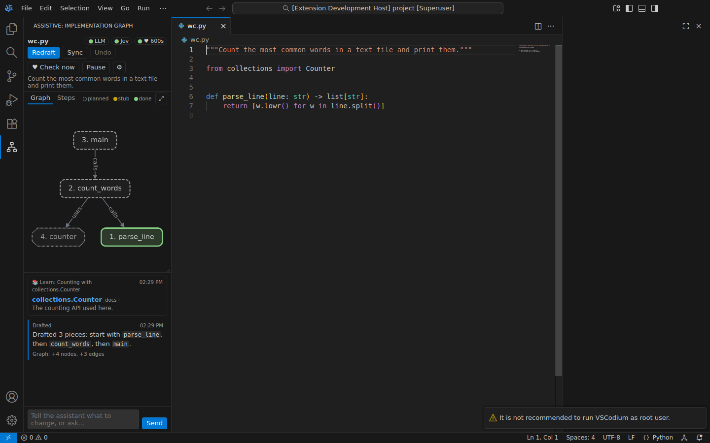

# Assistive documentation

This folder contains the full documentation for Assistive. Assistive is a VS Code extension. It shows an implementation graph in a side panel. The programmer and an LLM build the graph together. The programmer types all of the code. A heartbeat watches the code and interrupts the programmer only when a problem is important.

## Who must read which document

| Reader | Start here | Then read |
|---|---|---|
| A programmer who wants to use Assistive | [Introduction](01-introduction.md) | [Installation](02-installation.md), [Configuration](03-configuration.md), [User guide](04-user-guide.md) |
| A programmer with a problem | [Troubleshooting](05-troubleshooting.md) | [Configuration](03-configuration.md) |
| A developer who wants to change the code | [Architecture](06-architecture.md) | All documents from 07 to 17 |
| A reviewer who wants to know what the LLM can do | [Tool reference](10-tool-reference.md) | [LLM agent](09-llm-agent.md), [Assistant turns](12-assistant.md) |

## List of documents

### Part 1: Use Assistive

1. [Introduction](01-introduction.md): what Assistive does, the main concepts, and the limits.
2. [Installation](02-installation.md): how to build, install, examine and remove the extension.
3. [Configuration](03-configuration.md): the `.env` file, each variable, the VS Code settings, and the code that reads them.
4. [User guide](04-user-guide.md): the panel, and step-by-step procedures for each task.
5. [Troubleshooting](05-troubleshooting.md): symptoms, causes and corrective actions.

### Part 2: How the code works

6. [Architecture](06-architecture.md): the components, the data flows, the invariants and the shared types.
7. [Code analysis](07-code-analysis.md): the tree-sitter parser, the outline, the module docstring, the record of edits and workspace access (`src/code/`).
8. [Graph model](08-graph-model.md): nodes, edges, the validated graph editor, status sync and the typing order (`src/graph/`).
9. [LLM agent](09-llm-agent.md): the tool-call loop, the schema validator and the prompts (`src/llm/agent.ts`, `schema.ts`, `prompts.ts`).
10. [Tool reference](10-tool-reference.md): each of the 19 tools that the LLM can use (`src/llm/tools.ts`).
11. [Jev and the heartbeat](11-jev-and-heartbeat.md): the Jev client, the triage questions, the decision rules and the heartbeat runner (`src/llm/jev.ts`, `src/heartbeat/`).
12. [Assistant turns](12-assistant.md): draft, chat, sync, heartbeat and struggle turns (`src/assistant/Assistant.ts`).
13. [Store and resources](13-store-and-resources.md): the graph store, the undo history and the link check (`src/store/`, `src/resources/`).
14. [Panel](14-panel.md): the webview host, the message protocol and the webview script (`src/panel/`).
15. [Controller](15-controller.md): the connection to VS Code, the commands and the events (`src/controller.ts`, `src/extension.ts`).
16. [Build, test and CI](16-build-and-test.md): the build, the lint rules, the unit tests, the integration tests and CI.
17. [Extend Assistive](17-extending.md): procedures to add a tool, a language, a Jev question or a panel message.

### Reference

- [Glossary](glossary.md): the terms and the technical names in these documents.

## Writing standard

These documents use ASD-STE100 Simplified Technical English. The rules that apply most are these:

- Descriptive sentences have a maximum of 25 words. Procedural sentences have a maximum of 20 words.
- A paragraph has one topic and a maximum of six sentences.
- Procedures use the imperative and one instruction for each step.
- The verbs are in the active voice and in the simple present, simple past or simple future tense.
- One word has one meaning. The [glossary](glossary.md) gives the technical names.
- Notes and cautions come before the step that they apply to.

Code names (`GraphEditor`, `add_nodes`, `ASSISTIVE_LLM_MODEL`) are technical names. They stay as the code writes them.

## Conventions

- **Line numbers.** The code keeps line numbers 0-based. The LLM tools, the prompts and the panel show 1-based line numbers. Each document tells which form it uses.
- **Paths.** A path such as `src/llm/tools.ts` is relative to the `extension/` folder, unless the document tells you a different root.
- **Mathematics.** Formulas use $\LaTeX$ notation between dollar signs, for example $P(\text{interrupt}) \ge 0.65$.
- **Diagrams.** Diagrams use Mermaid. GitHub shows them as pictures.
