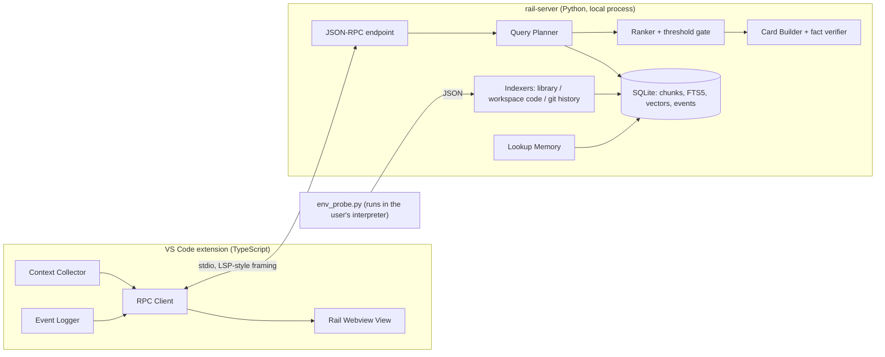

# Reference Rail: Design & Implementation Plan

> **Audience:** an autonomous coding agent building this system, plus the human reviewing its work.
> **Working name:** Reference Rail, a VS Code companion that brings the right documentation and prior code to the cursor so the programmer never leaves the editor to look something up.
> **Status:** MVP plan. Python is the target language for v1.

---

## 0. How to use this document (agent: read first)

1. Read the whole document before writing any code.
2. Build in the phase order of §12. A phase is done only when every acceptance check passes. Record the result in `PROGRESS.md` (date, phase, checks passed, known gaps).
3. The **invariants in §2 are hard constraints.** If a task seems to require breaking one, stop and ask the human.
4. Use only the dependencies allowed in §6. To propose another, add an entry to `DECISIONS.md` with the reason and alternatives, then wait for approval.
5. **Never guess a third-party API.** Check the installed version's source or docs for the VS Code API, `griffe`, `fastembed` and `vscode-jsonrpc`. Pin every version.
6. If the same blocker defeats you twice, write it up in `PROGRESS.md` and stop. Don't paper over it.
7. Build nothing outside scope (§3). Code generation, inline completion and chat are out of scope by design.

---

## 1. Problem and thesis

Programmers lose a large share of their time getting information rather than writing code: recalling an API, finding how something was done before, or checking what a function raises. One lookup costs roughly

$$t_{\text{lookup}} = t_{\text{switch}} + t_{\text{query}} + t_{\text{scan}} + t_{\text{adapt}} + t_{\text{resume}}$$

The terms are:

- $t_{\text{switch}}$: leaving the editor.
- $t_{\text{query}}$: putting a vague need into search words.
- $t_{\text{scan}}$: reading a page to find the one relevant fact.
- $t_{\text{adapt}}$: mapping a generic example onto your own code.
- $t_{\text{resume}}$: rebuilding the working memory you lost while away.

**Thesis:** with the editor context as the query and a reply of one extracted fact with its source, all shown in a side panel, $t_{\text{switch}}$, $t_{\text{query}}$ and $t_{\text{resume}}$ drop to roughly zero and $t_{\text{scan}}$ shrinks sharply. The human still writes every line.

**North-star metric:** external lookups per active editing hour, i.e. editor blur events as a proxy (§9.8). Lower is better.

---

## 2. Product invariants (hard constraints)

| ID | Invariant | How it is enforced |
|----|-----------|--------------------|
| I1 | **The extension never modifies the user's buffers.** No inserts, no edits, no code actions that write. | No `TextEditor.edit`, `WorkspaceEdit` or `applyEdit` anywhere in `extension/src`. A lint script in CI greps for them. |
| I2 | **Every displayed fact carries a `SourceRef`** pointing to a real file span (or a runtime-introspected builtin with its Python version). | A `Card` schema validator rejects facts without a source. |
| I3 | **Docstring-derived fact text must appear verbatim** (after whitespace normalization) in the source span it cites. | `verify_fact()` runs before every card is returned. A property test runs it over the whole fixture index. |
| I4 | **No network access by default.** Everything (indexing, embeddings, ranking) runs locally. The optional LLM extractor (Phase 5) is off unless the user configures it. | The server has no HTTP client dependency outside `extract/grounded_llm.py`. A CI test runs the full suite with networking disabled. |
| I5 | **Typing is never blocked.** All server work is asynchronous and stale requests are dropped. | Latency budgets in §10, plus a typing-stress test in Phase 3. |
| I6 | **Precision over recall.** Below the confidence threshold, show nothing. | Threshold gate in the ranker. An empty state is a valid outcome. |
| I7 | **Data stays on the machine.** The index, events and metrics live under `~/.reference-rail/`. | No telemetry upload code exists. |

---

## 3. Non-goals for the MVP

- Code generation, inline completion, ghost text or "apply" buttons (see I1).
- A chat panel or conversational interface.
- Languages other than Python (the design keeps language-specific code behind interfaces so TypeScript can come later).
- Web docs, Stack Overflow or other online sources.
- Team or shared indexes and cloud sync.
- A learned ranker. v1 uses heuristics and logs the data a learned ranker would need later.

---

## 4. Architecture



**Process model**

- The extension spawns `rail-server` as a child process over stdio and restarts it with exponential backoff, at most 3 times in 5 minutes.
- The server runs on `asyncio`. Indexing runs in a `ProcessPoolExecutor` so queries stay responsive. SQLite runs in WAL mode.
- The server has its **own** virtualenv, separate from the user's project. To learn about the user's environment it runs `env_probe.py` **with the user's interpreter** and reads JSON from that script's stdout.

**Request flow**

1. The editor fires an event and the Context Collector debounces it.
2. The collector builds a `ContextFrame` and sends `context/query`.
3. The planner picks sources and the ranker scores candidates.
4. The card builder extracts and verifies facts, and the server returns at most 3 `Card`s.
5. The webview renders them and the event logger records what happens next.

---

## 5. Repository layout

```
reference-rail/
├── PROGRESS.md                 # agent-maintained phase log
├── DECISIONS.md                # architecture decision records
├── extension/                  # VS Code extension (TypeScript)
│   ├── package.json            # contributes: views, commands, keybindings, config
│   ├── esbuild.mjs
│   ├── src/
│   │   ├── extension.ts        # activate/deactivate, wiring
│   │   ├── server/ServerProcess.ts   # spawn, restart, interpreter discovery
│   │   ├── rpc/Client.ts       # vscode-jsonrpc wrapper, cancellation
│   │   ├── context/ContextCollector.ts
│   │   ├── context/symbols.ts  # definition/hover resolution helpers
│   │   ├── rail/RailViewProvider.ts
│   │   ├── rail/webview/       # index.html, rail.css, rail.ts (no framework)
│   │   ├── telemetry/EventLogger.ts
│   │   └── commands.ts
│   └── test/                   # @vscode/test-electron + mocha
├── server/                     # rail-server (Python)
│   ├── pyproject.toml          # managed with uv
│   ├── rail_server/
│   │   ├── __main__.py
│   │   ├── rpc.py              # framing, dispatch, cancellation
│   │   ├── models.py           # pydantic v2 schemas (mirror of TS types)
│   │   ├── config.py
│   │   ├── store/db.py         # SQLite schema, migrations, FTS5 check
│   │   ├── store/vectors.py    # numpy brute-force index behind an interface
│   │   ├── index/env_probe.py  # runs in USER interpreter; stdlib only
│   │   ├── index/library.py    # griffe-based API extraction
│   │   ├── index/code.py       # ast-based workspace chunking
│   │   ├── index/git_history.py
│   │   ├── index/embeddings.py # fastembed wrapper
│   │   ├── retrieve/planner.py
│   │   ├── retrieve/ranker.py
│   │   ├── cards/build.py
│   │   ├── cards/verify.py     # invariant I3
│   │   ├── memory/lookups.py
│   │   ├── metrics/report.py
│   │   └── extract/grounded_llm.py   # Phase 5, disabled by default
│   └── tests/
├── eval/
│   ├── fixtures/make_fixtures.py   # builds fixture venv + git repo deterministically
│   ├── queries.jsonl               # labeled ContextFrames → expected results
│   └── run_eval.py
└── scripts/check_invariants.sh     # I1/I4 greps for CI
```

---

## 6. Tech stack and allowed dependencies

**Extension (TypeScript, Node ≥ 20, VS Code engine ≥ 1.90)**

- Runtime: `vscode-jsonrpc` and `@vscode/python-extension` (to get the active interpreter).
- Dev: `typescript`, `esbuild`, `eslint`, `mocha`, `@vscode/test-electron`.
- The webview uses vanilla TypeScript and CSS with VS Code theme variables. No UI framework.

**Server (Python ≥ 3.10, managed with `uv`)**

- Runtime: `griffe` (static API extraction and docstring parsing), `fastembed` (local ONNX embeddings), `numpy`, `pydantic>=2` and `pathspec`.
- Dev: `pytest`, `pytest-asyncio`, `ruff` and `mypy`.
- Optional (Phase 5 only, lazily imported): `httpx`.

**Startup check:** confirm that SQLite has FTS5 (`CREATE VIRTUAL TABLE ... USING fts5`). If it doesn't, exit with a clear error message.

**Embedding model:** configurable. In Phase 2, run a short spike comparing 2–3 small models that `fastembed` supports on `eval/queries.jsonl`. Pick by recall@3 and latency, and record the choice in `DECISIONS.md`.

---

## 7. Data model

### 7.1 SQLite schema (`~/.reference-rail/index.sqlite`)

```sql
PRAGMA journal_mode = WAL;

CREATE TABLE files (
  path          TEXT PRIMARY KEY,           -- absolute
  source_kind   TEXT NOT NULL CHECK (source_kind IN ('library','workspace','history')),
  dist_name     TEXT, dist_version TEXT,    -- library only
  repo          TEXT,                       -- workspace/history only
  mtime REAL, size INTEGER, content_hash TEXT NOT NULL
);

CREATE TABLE chunks (
  id            INTEGER PRIMARY KEY,
  kind          TEXT NOT NULL CHECK (kind IN ('api','code')),
  qualname      TEXT,                       -- e.g. requests.api.get
  path          TEXT NOT NULL REFERENCES files(path) ON DELETE CASCADE,
  start_line    INTEGER NOT NULL, end_line INTEGER NOT NULL,   -- 1-based inclusive
  signature     TEXT,
  docstring     TEXT,                       -- raw, verbatim
  doc_sections  TEXT,                       -- JSON: parsed sections w/ line offsets
  raises_scan   TEXT,                       -- JSON: [{"exc":"ValueError","line":42}]
  body          TEXT,                       -- truncated to 200 lines
  dist_name TEXT, dist_version TEXT,
  repo TEXT, commit_sha TEXT, authored_at TEXT,
  deleted       INTEGER NOT NULL DEFAULT 0, -- 1 = recovered from git history
  is_private    INTEGER NOT NULL DEFAULT 0,
  origin        TEXT NOT NULL DEFAULT 'source' CHECK (origin IN ('source','runtime_doc'))
);
CREATE INDEX chunks_qualname ON chunks(qualname);
CREATE INDEX chunks_path_lines ON chunks(path, start_line, end_line);

CREATE VIRTUAL TABLE chunks_fts USING fts5(
  qualname, signature, docstring, body,
  content='chunks', content_rowid='id', tokenize='unicode61'
);
-- keep chunks_fts in sync with triggers (insert/delete/update)

CREATE TABLE embeddings (
  chunk_id INTEGER PRIMARY KEY REFERENCES chunks(id) ON DELETE CASCADE,
  model TEXT NOT NULL, dim INTEGER NOT NULL, vec BLOB NOT NULL   -- float16
);

CREATE TABLE indexed_dists (                 -- dedupe libraries across projects
  dist_name TEXT, dist_version TEXT, indexed_at TEXT,
  PRIMARY KEY (dist_name, dist_version)
);

CREATE TABLE events (
  id INTEGER PRIMARY KEY,
  ts TEXT NOT NULL,
  type TEXT NOT NULL,     -- card_shown | card_opened | card_pinned | card_dismissed
                          -- | focus_lost | focus_gained | explicit_query | edit_tick
  card_id TEXT, qualname TEXT, trigger TEXT,
  payload TEXT            -- JSON
);

CREATE TABLE pins (qualname TEXT PRIMARY KEY, chunk_id INTEGER, pinned_at TEXT);
```

Library chunks are keyed by `(dist_name, dist_version)`, so a library version indexed once serves every project that uses it.

### 7.2 Wire schemas (TypeScript shown; mirror exactly in `models.py`)

```ts
type Trigger = "cursor_pause" | "edit_pause" | "diagnostic" | "hover" | "explicit";

interface SourceLoc { path: string; line: number; character: number }   // 0-based (VS Code)

interface ContextFrame {
  requestId: number;                 // strictly increasing per session
  trigger: Trigger;
  docUri: string;
  languageId: string;
  cursor: { line: number; character: number };
  enclosingText: string;             // enclosing def/class, else ±40 lines; ≤ 4 KB
  enclosingRange?: { startLine: number; endLine: number };
  symbolAtCursor?: { text: string; definition?: SourceLoc; hoverText?: string };
  nearbyDefinitions: SourceLoc[];    // resolved defs for identifiers on cursor line, ≤ 5
  recentEdits: { line: number; text: string; ts: number }[];   // ≤ 10
  diagnostics: { message: string; line: number; source?: string }[]; // within ±5 lines
  explicitQuestion?: string;
}

interface SourceRef {
  path: string; startLine: number; endLine: number;   // 1-based inclusive
  distName?: string; distVersion?: string;
  repo?: string; commit?: string; deleted?: boolean;
  runtime?: { pythonVersion: string };                 // origin = runtime_doc
}

interface Fact {
  label: "signature" | "summary" | "returns" | "raises" | "param" | "note";
  text: string;
  origin: "signature" | "docstring" | "source_scan" | "runtime_doc";
  span: SourceRef;                   // I2
}

interface Card {
  id: string;                        // stable: hash(kind, chunk_id)
  kind: "api" | "precedent" | "frequent";
  title: string;                     // e.g. "requests.get · requests 2.32.3"
  facts: Fact[];
  snippet?: { text: string; startLine: number };       // precedent cards
  source: SourceRef;
  confidence: number;                // 0..1
  reason: string;                    // short "why shown", e.g. "Cursor on resolved symbol"
}
```

---

## 8. Protocol (JSON-RPC 2.0 over stdio, LSP-style `Content-Length` framing)

| Method | Direction | Params → Result | Notes |
|--------|-----------|-----------------|-------|
| `initialize` | ext → srv | `{workspaceRoots, pythonPath, config}` → `{serverVersion, capabilities}` | Must finish in < 1 s. Indexing starts afterwards. |
| `index/sync` | ext → srv | `{roots?}` → `{started: true}` | Runs in the background. |
| `index/progress` | srv → ext (notification) | `{phase, done, total, message}` | Shown in the status bar. |
| `index/fileChanged` | ext → srv (notification) | `{path}` | Sent on save; the server re-chunks that file. |
| `index/status` | ext → srv | `{}` → `{dists, chunks, embedded, lastSync}` | |
| `context/query` | ext → srv | `ContextFrame` → `{requestId, cards: Card[]}` | If a newer `requestId` arrives, abandon the older one and return `{cards: []}` for it. |
| `$/cancelRequest` | ext → srv | `{id}` | Standard cancellation. |
| `events/log` | ext → srv (notification) | `{events: Event[]}` | Batched every 2 s. |
| `memory/frequent` | ext → srv | `{}` → `Card[]` | |
| `memory/pin` / `memory/unpin` | ext → srv | `{cardId}` → `{}` | |
| `metrics/report` | ext → srv | `{sinceDays}` → `MetricsReport` | |
| `shutdown` / `exit` | ext → srv | | |

Use `vscode-jsonrpc`'s `StreamMessageReader`/`StreamMessageWriter` on the extension side. On the server, implement the framing by hand (about 80 lines, fully tested). Server logs go to **stderr** only, because stdout carries the protocol.

---

## 9. Component design

### 9.1 Context Collector (`extension/src/context/ContextCollector.ts`)

**Event sources and debounce**

| VS Code event | Trigger | Debounce |
|---------------|---------|----------|
| `window.onDidChangeTextEditorSelection` | `cursor_pause` | 350 ms after the last change |
| `workspace.onDidChangeTextDocument` | `edit_pause` | 800 ms after the last edit |
| `languages.onDidChangeDiagnostics` (current doc, within ±5 lines of the cursor) | `diagnostic` | 300 ms |
| Command `referenceRail.askAboutSymbol` | `explicit` | none |
| `workspace.onDidSaveTextDocument` | sends `index/fileChanged` (no query) | none |
| `window.onDidChangeWindowState` | logs `focus_lost` / `focus_gained` | none |

Only Python documents trigger queries in v1. Ignore events from non-`file:` URIs and from output panels.

**Building the frame**

The whole build has a budget of 20 ms of extension-side work, plus definition lookups bounded by a 150 ms timeout.

1. `enclosingText`: find the enclosing `def` or `class` with `vscode.executeDocumentSymbolProvider`. If there is none, take ±40 lines. Truncate to 4 KB.
2. `symbolAtCursor`: use the word range at the cursor (`document.getWordRangeAtPosition`). Resolve it with `vscode.executeDefinitionProvider`, and also try `vscode.executeHoverProvider` and keep the raw hover markdown as `hoverText` for the fallbacks.
3. `nearbyDefinitions`: resolve up to 5 distinct identifiers on the cursor line in parallel, with a shared 150 ms timeout. Drop any that don't resolve in time.
4. `recentEdits`: keep a ring buffer of the last 10 changed lines in this document.

**Cancellation:** each new frame cancels the in-flight request through the JSON-RPC cancellation token.

### 9.2 Interpreter discovery and environment probe

1. Get the active interpreter for the workspace folder through `@vscode/python-extension` (`PythonExtension.api()` → `environments.getActiveEnvironmentPath()`). Verify these names against the installed package. If that fails, fall back to the `referenceRail.pythonPath` setting, then to `python3` on `PATH`.
2. The server runs `<userPython> env_probe.py`. **`env_probe.py` may use the standard library only** and must work on Python 3.8+. It prints JSON:
   ```json
   {"python_version": "3.12.4", "stdlib_dir": "...", "site_dirs": ["..."],
    "dists": [{"name": "requests", "version": "2.32.3", "py_files": ["/abs/.../requests/api.py"]}],
    "builtins": [{"qualname": "builtins.dict.get", "signature": "...", "doc": "..."}]}
   ```
   - Collect distributions with `importlib.metadata.distributions()` and resolve each file with `dist.locate_file()`.
   - Introspect `builtins` and C extension modules at runtime (`inspect.signature` where it works, plus `__doc__`). Those chunks get `origin = runtime_doc`.
   - Pure-Python standard library modules are indexed from source as a pseudo-dist named `stdlib`, with the Python version as its version.

### 9.3 Library indexer (`server/rail_server/index/library.py`)

For each `(dist, version)` not yet in `indexed_dists`:

1. Load its packages statically with `griffe`, without importing user code (`allow_inspection=False`, with `search_paths` set to the site dirs). Pin the `griffe` version and confirm its API names against the installed version, since the API has moved between releases.
2. Walk modules, classes, functions and methods. For each, emit a chunk with the `qualname`, a rendered signature, the raw docstring, its line range and the file path.
3. Parse docstring sections with griffe's parsers, trying google, then numpy, then sphinx, and keep the first one that yields sections. Store the sections with their line offsets so facts can point to exact lines.
4. **Raise scan:** walk the function's `ast` and record each `raise X(...)` and `raise X` with its line (origin `source_scan`). Skip bare re-raises.
5. Set `is_private = 1` for names that start with `_` (but not dunder methods). Skip `tests/`, `test_*.py` and vendored test directories.
6. Commit each dist in its own transaction. Indexing must be resumable if interrupted.

**Throughput target:** a typical environment of about 80 dists indexes (without embeddings) in ≤ 3 minutes on a laptop. Library API chunks are **not embedded in v1**. They're found by exact resolution and FTS, which keeps embedding cost proportional to the user's own code.

### 9.4 Workspace code indexer (`index/code.py`) and git history (`index/git_history.py`)

**Roots:** the workspace folders plus the `referenceRail.extraRepos` setting (your other projects).

**File list:** use `git ls-files` where possible. Otherwise walk the tree, applying `.gitignore` rules through `pathspec`. Always exclude `.env*`, `*secret*`, `*.pem`, `venv/`, `.venv/`, `node_modules/` and `site-packages/`.

**Chunking:** use Python `ast` to make one chunk per function, method and class, with decorators included and the body truncated to 200 lines. If a file fails to parse, skip it and log the error. Never crash on bad syntax.

**Metadata:** get `commit_sha` and `authored_at` per file from a single `git log --name-only --format=...` pass. Don't run one git process per file.

**Embeddings:** the embedding text is `qualname + signature + docstring + body[:N]`, where N fits the model's token limit. Batch 64 chunks at a time and store vectors as float16.

**Incremental updates:** when `index/fileChanged` arrives, compare content hashes, re-chunk the file, and re-embed only the chunks that changed.

**Git history (Phase 4):** for the last `referenceRail.historyDepth` commits (default 500), parse the `ast` of each modified Python file before and after the commit. A function present before and absent after becomes a chunk with `deleted = 1` and `commit_sha` set to the deleting commit. This runs at low priority after everything else is indexed.

### 9.5 Query planner and ranker (`retrieve/`)

```text
plan(frame):
  candidates = []

  # A. Exact API resolution (highest precision)
  for loc in [frame.symbolAtCursor.definition] + frame.nearbyDefinitions:
      chunk = resolve_api(loc, frame)            # fallback chain below
      if chunk: candidates.append(api(chunk, conf = 1.0 if loc is cursor symbol else 0.8))

  # B. Diagnostics: identifiers mentioned in error messages
  if frame.trigger == "diagnostic":
      for ident in identifiers_in(frame.diagnostics):
          chunk = lookup_qualname_suffix(ident, imports_of(frame.docUri))
          if chunk: candidates.append(api(chunk, conf = 0.7))

  # C. Precedent search (own code)
  if frame.trigger in ("edit_pause", "explicit") and len(frame.enclosingText) >= 80:
      q_vec  = embed(frame.enclosingText + recent_edit_lines)
      q_fts  = fts_query(identifiers(frame.enclosingText), top_k=10)   # OR of rare identifiers
      hits   = rrf_fuse(vector_top_k(q_vec, 20, kind='code'), q_fts, k=60)
      hits   = exclude_self(hits, frame.docUri, frame.enclosingRange)  # don't show the code being edited
      for h in hits:
          if h.cosine >= cfg.precedent_threshold:                      # gate on calibrated cosine
              candidates.append(precedent(h, conf = calibrate(h.cosine)))

  return top_n(dedupe(candidates), n = cfg.max_cards)   # default 3; empty is fine (I6)
```

**`resolve_api` fallback chain**

1. **Exact span:** look up the chunk whose `[start_line, end_line]` contains `loc.line + 1` in `loc.path`.
2. **Stub path:** if `loc.path` is a `.pyi` file outside the index (for example, stubs bundled with the language server), derive the module from the stub's path (`.../requests/api.pyi` → `requests.api`), append the symbol text, and look up by `qualname`.
3. **Hover text:** parse a qualified name or signature from `hoverText` and look up by `qualname` or by suffix.
4. **Imports:** map the symbol through the current file's `import` statements (parsed with `ast` on the server) to a `qualname`.

**Ordering:** sort by confidence, then prefer the cursor symbol, then the same repo, then the most recent `authored_at`. Down-rank private symbols by 0.2.

**Calibration:** in Phase 2, set `precedent_threshold` from `eval/queries.jsonl` so that precision is at least 0.8 at the chosen threshold. Record the value in `DECISIONS.md`. Fused RRF scores aren't calibrated, so use them for ordering only. The gate always uses cosine similarity.

### 9.6 Card builder and verifier (`cards/`)

**API card**, with facts in this order:

1. The signature (origin `signature`).
2. A summary: the first paragraph of the docstring.
3. **Returns.**
4. **Raises**, from docstring sections and the raise scan. Mark scanned raises as "found in source".
5. Up to 3 parameter descriptions, preferring the parameter the cursor is in if it's inside call parentheses.

The title is `qualname · dist version`.

**Precedent card:** the snippet (at most 15 lines centered on the most similar region, otherwise the head of the function), the repo, path, commit date, and a "deleted in `<sha>`" badge if it came from history.

**`verify_fact` (I3):** load the cited span from disk (or from the stored chunk for `runtime_doc`), normalize whitespace, and check that `fact.text` is a substring of it. If the check fails, drop the fact and log a warning. A card left with no facts is dropped entirely.

**Staleness:** if a library file's `content_hash` no longer matches the file on disk, the card shows a "re-indexing" badge and a re-index is queued.

### 9.7 Rail UI (`rail/`)

**Container:** a `WebviewView` in a dedicated activity-bar container called "Reference". Users can drag it to the secondary sidebar, and the README should recommend doing so.

**Layout, top to bottom:**

1. **Frequent:** collapsed, at most 5 entries.
2. **Pinned.**
3. **Live cards:** at most 3.
4. A thin status line: index state and the last query's latency.

**Stability (no flicker):**

- Diff cards by `id` and leave unchanged cards untouched.
- A live card stays visible for at least 1.5 s before it can be replaced.
- An empty result fades the live section out after 3 s; it doesn't clear it instantly.

**Interactions:** each card has these actions, sent to the extension through `postMessage`:

- Open source: `showTextDocument(uri, {selection, preview: true, preserveFocus: true})`.
- Pin.
- Dismiss.
- Copy. This copies to the clipboard only. It never inserts into the buffer (I1).

**Styling:** use only VS Code theme CSS variables (`--vscode-editor-font-family`, `--vscode-foreground`, and so on). Signatures render in the editor font, and nothing animates except the fade.

**Commands and default keybindings** (check for conflicts and record them in `DECISIONS.md`):

| Command | Default keybinding | Action |
|---------|--------------------|--------|
| `referenceRail.focus` | `ctrl+alt+r` | Focus the rail. |
| `referenceRail.askAboutSymbol` | `ctrl+alt+/` | Open an input box (optional question) and send an explicit frame. |
| `referenceRail.pinTopCard` | | Pin the top card. |
| `referenceRail.toggle` | | Pause or resume the rail. |
| `referenceRail.showMetrics` | | Show the metrics report. |
| `referenceRail.reindex` | | Re-index. |

### 9.8 Lookup memory and metrics

**Frequent lookups:** a `qualname` with at least 3 `card_opened` or `explicit_query` events in a sliding 14-day window appears in the Frequent section. Pins never expire.

**External-lookup proxy:** a `focus_lost` → `focus_gained` pair counts as one external lookup when all of these hold:

- the blur lasted at least 3 s and at most 10 min,
- no debug session was active (`vscode.debug.activeDebugSession`),
- and an edit happened within the 2 minutes before the blur.

**Active editing hour:** an hour bucket containing at least 6 `edit_tick` events. The extension emits one `edit_tick` per minute that has any edits.

**`MetricsReport`** contains:

- external lookups per active hour (the north star)
- cards shown, opened, pinned and dismissed, with the open rate per card kind
- p50 and p95 `context/query` latency
- an empty-result rate per trigger

The report can be exported to CSV through the metrics view.

---

## 10. Performance budgets

| Path | Budget |
|------|--------|
| Building the frame in the extension (excluding definition lookups) | ≤ 20 ms |
| Definition and hover resolution | 150 ms hard timeout, then proceed without it |
| `context/query`, API-only path | p95 ≤ 150 ms |
| `context/query` with precedent search (≤ 200k code chunks, brute-force float16) | p95 ≤ 400 ms |
| Server resident memory | ≤ 600 MB including the embedding model |
| `initialize` | < 1 s; indexing never blocks queries |
| Typing stress test (10 chars/s for 60 s) | no dropped keystrokes, no main-thread task > 50 ms caused by the extension |

If brute-force vector search exceeds its budget on a real index, swap in an approximate index behind the `store/vectors.py` interface. That needs a decision record first.

---

## 11. Privacy and security

- All data lives under `~/.reference-rail/`. A `referenceRail.clearData` command deletes it.
- Never index files matching the exclusion list in §9.4. Never store environment variables.
- `env_probe.py` only reads metadata. It never imports user packages, and it introspects only `builtins` and C modules that are already importable.
- The webview uses a strict CSP: no remote resources, scripts only through a nonce.
- Phase 5's LLM extractor is off by default. When enabled, it shows a one-time consent notice listing exactly what it sends (the question and at most 5 retrieved chunks).

---

## 12. Phases

Each phase lists tasks and acceptance checks. Every check must pass before you start the next phase.

### Phase 0: Scaffold
- [ ] Monorepo layout from §5, `uv` project, `package.json`, esbuild, CI (lint, type-check, tests on Linux/macOS).
- [ ] The extension spawns the server; `initialize` and `shutdown` round-trip; restart with backoff.
- [ ] `scripts/check_invariants.sh` for I1 and I4.

**Accept when:**
- ☐ Command "Reference Rail: Ping" shows the server version.
- ☐ Killing the server process triggers an automatic restart.
- ☐ CI is green.

### Phase 1: Library index and API cards
- [ ] `env_probe.py`, the SQLite schema and migrations, the FTS5 startup check.
- [ ] The library indexer (§9.3), including `runtime_doc` builtins.
- [ ] The Context Collector with the `cursor_pause` trigger only, and `resolve_api` steps 1–4.
- [ ] The API card builder, `verify_fact`, and a basic rail view (live cards only).

**Accept when:**
- ☐ In `eval/fixtures/fixture_app` with `requests` installed, the cursor on `requests.get` shows a card whose version matches `pip show requests`, and "Open source" lands on the `def get` line.
- ☐ The cursor on `d.get` where `d: dict` shows a `runtime_doc` card for `dict.get`.
- ☐ The I3 property test passes over the entire fixture index.
- ☐ API-path p95 is ≤ 150 ms over 500 replayed frames.

### Phase 2: Workspace index and precedent cards
- [ ] The code indexer, incremental `index/fileChanged`, embeddings (including the model spike), the vector store, FTS fusion, `exclude_self`, and threshold calibration.
- [ ] The `edit_pause` trigger and precedent cards.

**Accept when:**
- ☐ On `eval/queries.jsonl` precedent queries: recall@3 ≥ 0.8 and precision ≥ 0.8 at the calibrated threshold.
- ☐ Editing a function never shows that same function as a precedent.
- ☐ Saving a file updates its chunks within 2 s.

### Phase 3: Flow quality
- [ ] The `diagnostic` and `explicit` triggers, cancellation, the flicker rules (§9.7), the event logger, the edit ticks and blur proxy, and the metrics report and view.

**Accept when:**
- ☐ The typing stress test (§10) passes.
- ☐ Sending 20 frames in quick succession produces exactly one render, for the last frame.
- ☐ `referenceRail.showMetrics` displays all `MetricsReport` fields from a seeded event log, and the CSV export matches.

### Phase 4: Memory and history
- [ ] Pins, the Frequent section, `extraRepos`, and git-history recovery of deleted functions.

**Accept when:**
- ☐ Opening the same API card 3 times makes it appear under Frequent.
- ☐ A function deleted in the fixture repo's history is found as a precedent with a "deleted in `<sha>`" badge.

### Phase 5 (optional, needs human approval): grounded answers for explicit questions
- [ ] `extract/grounded_llm.py`: a provider-agnostic interface `complete(system, user) -> str`, configured by the user (endpoint and key in VS Code SecretStorage).
- [ ] The prompt contract: the model receives the question and at most 5 chunks with IDs, and must return `{"answers": [{"quote": str, "chunk_id": int}]}`. **Quotes must be verbatim.**
- [ ] Run each quote through `verify_fact`. Drop any that fail. If none survive, show "No grounded answer found" with the top retrieved chunk instead. Never display any text the model wrote itself.

**Accept when:**
- ☐ On the labeled explicit-question set, 0 unverifiable quotes are displayed, and at least 70% of questions get one or more verified answers.

### Phase 6: Evaluation harness and dogfooding
- [ ] `eval/run_eval.py` (recall@3, MRR, precision at threshold, latency p50/p95, empty-result rate).
- [ ] Session record and replay: frames are logged to a JSONL file when `referenceRail.recordSessions` is on.
- [ ] A dogfooding guide in the README.

**Accept when:**
- ☐ `run_eval.py` runs in CI with networking disabled and fails the build on any regression greater than 5%.

---

## 13. Testing strategy

**Fixtures:** `eval/fixtures/make_fixtures.py` builds everything deterministically:

- a fixture venv with pinned `requests` and `attrs`
- `fixture_app`, a small app that uses them
- `fixture_history`, a scripted git repo with known near-duplicate functions, renamed functions, and deleted functions at known SHAs.

**Server unit tests:**

- framing and dispatch
- every `resolve_api` fallback step
- docstring section offsets
- the raise scan
- `verify_fact`
- RRF fusion
- `exclude_self`
- the metrics math against a seeded event log

**Property test:** for every chunk in the fixture index, every fact produced for it passes `verify_fact` (I3).

**Extension tests** (`@vscode/test-electron`):

- debounce timing
- cancellation
- card diffing with no re-render of unchanged cards
- the no-buffer-edits check (I1): run a full session and assert that no document version changes except those caused by the test's own typing.

**Labeled queries:** `eval/queries.jsonl` holds at least 60 frames, at least 25 API, 25 precedent and 10 diagnostic. Each line has an `expected` field (`qualname`s or chunk paths with line ranges), and some have `expected: []` so false positives are measured too.

---

## 14. Evaluation with humans (after Phase 4)

- **Design:** within-subject, 2 weeks of real work. The rail is on and off on alternating days, using `referenceRail.toggle` on a schedule the extension enforces.
- **Primary outcome:** external lookups per active hour, from §9.8.
- **Secondary outcomes:** card open rate, dismiss rate, and a 3-question end-of-day survey (interruptions, trust, usefulness).
- **Success bar for continuing past the MVP:** a reduction of at least 25% in external lookups per active hour on rail-on days, with a dismiss rate of 40% or less.

---

## 15. Open decisions for the human

1. **Language:** this plan assumes Python. Confirm it, or choose TypeScript (that would swap `griffe` for the TS compiler API and `ast` for tree-sitter).
2. **Copy button:** allowed (clipboard only) or removed for a strict "you type everything" stance?
3. **Phase 5:** pursue the grounded LLM extraction at all, and if so, which provider?
4. **History depth and cross-repo sources:** what are the defaults for `historyDepth` and `extraRepos`?
5. **Adaptation:** should precedent snippets ever be shown with identifiers renamed to the user's context (display only)? This is deferred, since it weakens the verbatim guarantee.

---

## 16. Definition of done (MVP = Phases 0–4 + 6)

- [ ] Every acceptance check through Phase 4, plus Phase 6, passes in CI.
- [ ] Invariants I1–I7 are covered by automated tests or CI checks.
- [ ] The README covers installation, recommended layout (rail in the secondary sidebar), commands, settings, privacy, and how to read the metrics.
- [ ] `PROGRESS.md` and `DECISIONS.md` are up to date. Every deviation from this plan is recorded with its reason.
